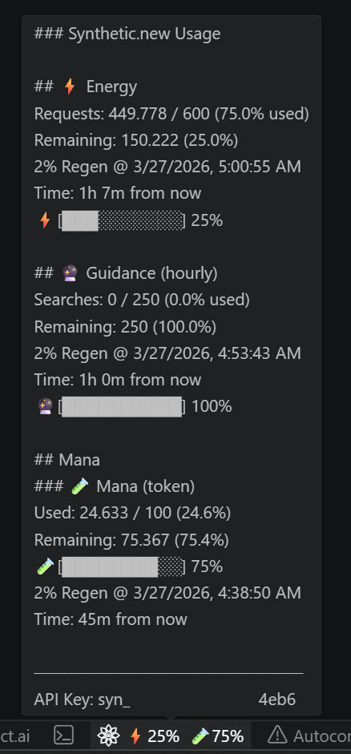
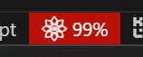
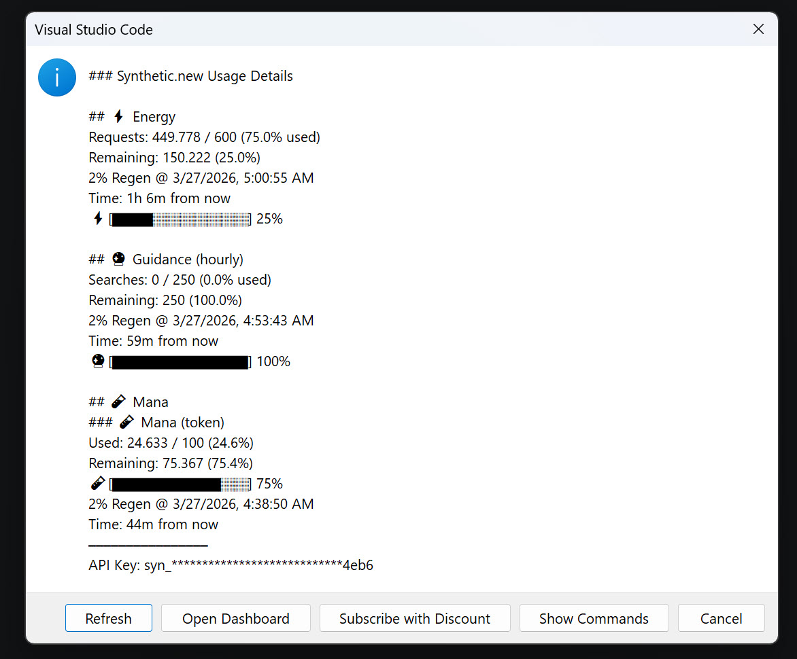
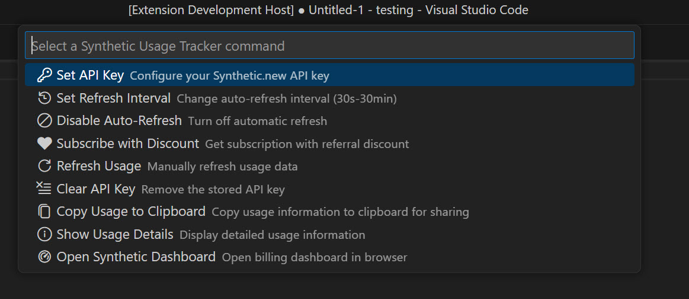

# Synthetic.new Usage Tracker

A VSCode extension that monitors your Synthetic.new API usage and quotas directly from the status bar.

[](https://marketplace.visualstudio.com/items?itemName=Ellipsis.synthetic-usage-tracker)
[](https://marketplace.visualstudio.com/items?itemName=Ellipsis.synthetic-usage-tracker)
[](https://marketplace.visualstudio.com/items?itemName=Ellipsis.synthetic-usage-tracker)

[](https://open-vsx.org/extension/Ellipsis/synthetic-usage-tracker)
[](https://open-vsx.org/extension/Ellipsis/synthetic-usage-tracker)
[](https://open-vsx.org/extension/Ellipsis/synthetic-usage-tracker)

[View Changelog](CHANGELOG.md)

## Features

- **Real-time Usage Tracking**: Monitor your Synthetic.new API quota usage directly from the VSCode status bar
- **Three-Quota Tracking**: Track usage across three distinct quota types - subscription (monthly), search.hourly (hourly search limit), and freeToolCalls (daily free tool call quota)
- **Multi-Key Management**: Support for multiple API keys with easy cycling and secure storage
- **Manual Key Cycling**: Quickly switch between multiple API keys using round-robin rotation
- **Secure Storage**: API keys are stored securely using VSCode SecretStorage with encryption
- **Key Management Commands**: Add, remove, and clear API keys with confirmation dialogs
- **Auto-refresh**: Automatically updates usage data at configurable intervals (minimum 30 seconds, maximum 30 minutes)
- **Visual Indicators**: Custom font icons for normal and loading states, color-coded status bar based on usage thresholds
- **Enhanced Tooltips**: Hover over the status bar to see detailed category breakdowns with ASCII progress bars and time remaining
- **Quota Warning Symbols**: Visual indicators (⚠️ for warning, 🔴 for critical) in the status bar when thresholds are exceeded
- **API Key Suffix Display**: Shows last 4 characters of the active API key in tooltips (masked for security)
- **Configurable Thresholds**: Set custom warning and critical usage percentages
- **Quick Actions**: Refresh, set interval, configure, and view details from the command palette or status bar
- **Copy to Clipboard**: Quickly copy formatted usage information (with progress bars) matching the popup view for sharing or bug reports
- **Context-Aware Commands**: Usage-related commands only appear when API key is configured
- **Intelligent Tooltip Management**: Tooltips temporarily clear on user interactions and auto-restore
- **Silent Launch**: Extension launches silently without auto-showing popups
- **Smart Refresh Button**: Reloads popup content when clicked instead of closing
- **Cross-Window Synchronization**: API key state automatically syncs across multiple VSCode windows

## Screenshots

### Status Bar & Tooltip

The status bar displays your current usage, and hovering over it shows detailed information including quota limits and renewal dates.



### Warning State

When your usage approaches the warning threshold (default: 80%), the status bar changes color to alert you. (Sorry, old screenshot)



### Usage Details

Click on the status bar item to view a detailed breakdown of your API usage, including raw numbers and quota information.



### Commands

Access all extension commands through the Command Palette (`Ctrl+Shift+P` or `Cmd+Shift+P`):



## Installation

### From VSCode Marketplace

[](https://marketplace.visualstudio.com/items?itemName=Ellipsis.synthetic-usage-tracker)

1. Open VSCode
2. Go to Extensions (Ctrl+Shift+X)
3. Search for "Synthetic.new Usage Tracker"
4. Click Install

### From Open VSX Registry

[](https://open-vsx.org/extension/Ellipsis/synthetic-usage-tracker)

1. Open VSCode
2. Go to Extensions (Ctrl+Shift+X)
3. Click the "..." menu in the top right
4. Select "Install from VSIX..."
5. Download the extension from [Open VSX Registry](https://open-vsx.org/extension/Ellipsis/synthetic-usage-tracker)
6. Or install using the command: `code --install-extension Ellipsis.synthetic-usage-tracker`

### From .vsix File

1. Download the latest `.vsix` file from the [Releases](https://github.com/AppliedEllipsis/synthetic-usage-tracker/releases) page
2. Open VSCode
3. Go to Extensions (Ctrl+Shift+X)
4. Click the "..." menu in the top right
5. Select "Install from VSIX..."
6. Select the downloaded `.vsix` file

## Getting Started

1. **Configure your API Key**:
   - Press `Ctrl+Shift+P` (or `Cmd+Shift+P` on Mac)
   - Type `Synthetic Usage Tracker: Configure API Key`
   - Enter your Synthetic.new API key (starts with `syn_`)

   **Quick Alternative: Click the Status Bar**
   - When no key is configured, the status bar shows in red with `Synthetic.new - No API key`
   - Simply click on the red status bar item
   - The API key configuration dialog will open immediately
   - This is the fastest way to set up your initial key on first launch

2. **View Your Usage**:
   - Look at the status bar on the right side
   - You'll see usage percentage and/or raw numbers
   - Click on the status bar item to see detailed information

3. **Configure Settings**:
   - Press `Ctrl+,` to open Settings
   - Search for "Synthetic Usage Tracker"
   - Adjust settings to your preference

### ASCII Progress Bars in Tooltips

Hover over the status bar to see detailed category breakdowns with visual progress bars for each quota type:

```
### Synthetic.new Usage Details

## ⚡ Energy
Requests: 449.778 / 600 (75.0% used)
Remaining: 150.222 (25.0%)
2% Regen @ 3/27/2026, 5:00:54 AM
Time: 1h 6m from now
⚡[███░░░░░░░] 25%

## 🔮 Guidance (hourly)
Searches: 0 / 250 (0.0% used)
Remaining: 250 (100.0%)
2% Regen @ 3/27/2026, 4:54:43 AM
Time: 59m from now
🔮[██████████] 100%

## 🧪 Mana
### 🧪 Mana (token)
Used: 24.636 / 100 (24.6%)
Remaining: 75.364 (75.4%)
🧪[████████░░] 75%
2% Regen @ 3/27/2026, 4:38:50 AM
Time: 43m from now
━━━━━━━━━━━━━━━━
API Key: syn_****************************4eb6
Timestamp: 2026-03-27T07:54:53.052Z
```

- `█` (filled block): Represents used quota
- `░` (empty block): Represents remaining quota

### Quota Warning Symbols

The status bar displays visual warning symbols based on your usage thresholds:

- **⚠️ (Warning)**: Appears when usage reaches the warning threshold (default: 80%)
- **🔴 (Critical)**: Appears when usage reaches the critical threshold (default: 90%)

**Category-specific warnings**: When individual quotas exceed 80%, specific warning symbols appear:

- **🔍 (search icon)**: Appears when Search (hourly) quota exceeds 80%
- **🔧 (wrench icon)**: Appears when Tool Calls quota exceeds 80%

The extension displays a maximum of 2 category warnings and 3 total symbols to keep the status bar readable.

## Multi-Key Management

The extension supports managing multiple API keys for flexibility and redundancy. All keys are stored securely in VSCode's encrypted SecretStorage.

### Adding API Keys

You can add multiple API keys to configure different Synthetic.new accounts or projects:

1. **Add a New Key**:
   - Press `Ctrl+Shift+P` (or `Cmd+Shift+P` on Mac)
   - Type `Synthetic Usage Tracker: Add API Key`
   - Enter your Synthetic.new API key (must start with `syn_`)
   - Optionally add a label for easy identification (e.g., "Dev Account", "Production Key")
   - The key is automatically added to your secure storage

### Cycling Between Keys

When you have multiple API keys configured, you can quickly switch between them:

1. **Cycle to Next Key**:
   - Press `Ctrl+Shift+P`
   - Type `Synthetic Usage Tracker: Cycle to Next Key`
   - The extension rotates to the next key in round-robin fashion
   - Usage data automatically refreshes with the new active key

2. **From Usage Details Popup**:
   - Click on the status bar to view usage details
   - **Single key configured**: Shows "Refresh", "Open Dashboard", and "Subscribe with Discount" buttons
   - **Multiple keys configured**: "Subscribe with Discount" button is replaced with "Cycle Keys" button
   - Click "Cycle Keys" to switch to the next key and view its usage in the same popup
   - The popup refreshes automatically with the new key's data

### Managing and Removing Keys

You can remove individual keys or clear all keys:

1. **Remove a Specific Key**:
   - Press `Ctrl+Shift+P`
   - Type `Synthetic Usage Tracker: Remove API Key`
   - Select the key you want to remove from the list
   - Confirm removal in the dialog
   - The extension will activate the next available key

2. **Clear All Keys**:
   - Press `Ctrl+Shift+P`
   - Type `Synthetic Usage Tracker: Clear All Keys`
   - Confirm the action in the dialog
   - All API keys are removed from secure storage
   - The extension returns to idle state (no keys configured)

### Viewing Active Key

The status bar tooltip shows which key is currently active:

```
API Key: syn_••••••••••••x789
```

The masked display reveals:

- Key prefix (`syn_`)
- Last 4 characters for identification
- Middle characters masked with dots (•) for security

### Cross-Window Synchronization

When you manage keys in one VSCode window, changes automatically sync across all open windows:

- Adding a key in one window → available in all windows
- Switching keys in one window → syncs to all windows
- Removing keys → updates across all windows

The extension uses polling (every 5 seconds) to detect changes made in other windows.

### Security and Storage

All API keys are stored using VSCode's SecretStorage API:

- **Encrypted storage**: Keys are encrypted at the operating system level
- **Workspace isolation**: Keys are stored per-workspace, not globally
- **No plaintext storage**: Keys are never written to files or settings
- **Secure deletion**: Removing keys permanently deletes them from encrypted storage

### Backward Compatibility

The extension automatically migrates from legacy single-key format (stored as `syntheticApiKey`) to the new multi-key format (stored as `syntheticApiKeys`). Your existing single key is preserved during migration.

## Three-Quota Structure (outdated with new rpg system)

The Synthetic.new API provides three separate quota types that are tracked independently:

- **Subscription**: Monthly quota for your account
- **Search (hourly)**: Hourly limit for search operations
- **Tool Calls**: Quota for tool call functionality

Each quota type has its own limit, usage count, and renewal schedule. The extension tracks all three quotas simultaneously and displays them in the tooltip for comprehensive visibility.

## Status Bar Features

The extension provides several visual indicators in the status bar to help you quickly understand your API usage status.

### API Key Suffix Display

The tooltip shows a masked version of your API key for easy identification:

```
API Key: syn_******************x7b9
```

This displays your API key with the prefix (`syn_`) and last 4 characters, with the middle masked with asterisks. The number of asterisks varies based on the key length. This helps you quickly verify which API key is currently active without revealing the full key.

**Format**: `syn_****...****abcd` where:

- `syn_` is the API key prefix
- `****` is variable-length asterisk mask (key length - 8 characters)
- `abcd` are the last 4 characters of your key

**Example lengths**:

- 12-character key: `syn_****abcd` (4 asterisks)
- 20-character key: `syn_************abcd` (12 asterisks)
- 40-character key: `syn_************************abcd` (32 asterisks)

**Edge cases handled**:

- Missing or undefined API keys: Shows "Key: Not configured"
- Short API keys (< 8 characters): Shows available characters with asterisks

### Custom Font Icons

The extension uses custom font icons featuring a **chemistry flask** (🧪) design for different states:

- **Normal state**: Chemistry flask icon when usage is displayed
- **Loading state**: Spinning chemistry flask icon when refreshing data

The flask icon represents the experimental and innovative nature of AI-assisted development with Synthetic.new. This provides a more polished and professional appearance compared to default VSCode icons.

### Intelligent Tooltip Behavior

The extension implements smart tooltip management:

- Tooltips temporarily clear on status bar clicks (restore after 500ms)
- Tooltips clear for longer periods when using specific commands (5 seconds for Show Commands)
- This prevents tooltips from covering UI elements while keeping them available most of the time

### Silent Launch

The extension starts silently without automatically popping up usage details windows when you first launch VSCode. You control when you want to view detailed usage information.

### Smart Refresh Button

When viewing the usage details popup, clicking the **Refresh** button reloads the data and shows the updated information in the same popup instead of closing it. This makes it easy to monitor your usage in real-time.

## Configuration

The extension can be configured through VSCode settings:

> **Note**: This info might be outdated.
> **Note**: Some configuration changes may not be reflected until the next refresh of usage data. You can manually refresh by clicking the status bar item or using the "Synthetic Usage Tracker: Refresh Usage" command.

| Setting                                     | Type    | Default                        | Description                                           |
| ------------------------------------------- | ------- | ------------------------------ | ----------------------------------------------------- |
| `syntheticUsageTracker.apiEndpoint`         | string  | `https://api.synthetic.new/v2` | The Synthetic.new API endpoint                        |
| `syntheticUsageTracker.refreshInterval`     | number  | `60`                           | Auto-refresh interval in seconds (min: 30, max: 1800) |
| `syntheticUsageTracker.showPercentage`      | boolean | `true`                         | Show usage as percentage in status bar                |
| `syntheticUsageTracker.showRawNumbers`      | boolean | `false`                        | Show raw request numbers in status bar tooltip        |
| `syntheticUsageTracker.enableNotifications` | boolean | `true`                         | Show notifications for API errors and quota warnings  |
| `syntheticUsageTracker.warningThreshold`    | number  | `80`                           | Usage percentage threshold for warning notifications  |
| `syntheticUsageTracker.criticalThreshold`   | number  | `90`                           | Usage percentage threshold for critical notifications |

## Commands

| Command                                             | Description                                                           | Availability          |
| --------------------------------------------------- | --------------------------------------------------------------------- | --------------------- |
| `Synthetic Usage Tracker: Set API Key`              | Configure or update your API key                                      | Always                |
| `Synthetic Usage Tracker: Set Refresh Interval`     | Set auto-refresh interval (30s-30min, accepts `60` seconds or `5min`) | Always                |
| `Synthetic Usage Tracker: Toggle Auto-Refresh`      | Enable or disable automatic refresh (shows current state in menu)     | Always                |
| `Synthetic Usage Tracker: Subscribe with Discount`  | Subscribe with referral bonus credits ($10 standard, $20 pro)         | Always                |
| `Synthetic Usage Tracker: Open Synthetic Dashboard` | Open the Synthetic.new dashboard in your browser                      | Always                |
| `Synthetic Usage Tracker: Refresh Usage`            | Manually refresh the usage data                                       | API key configured ⚠️ |
| `Synthetic Usage Tracker: Show Usage Details`       | Display detailed usage information with action buttons                | API key configured ⚠️ |
| `Synthetic Usage Tracker: Copy Usage to Clipboard`  | Copy formatted usage information to clipboard (with progress bars)    | API key configured ⚠️ |
| `Synthetic Usage Tracker: Clear API Key`            | Remove the stored API key                                             | API key configured ⚠️ |

⚠️ Commands marked with this icon only appear in the command palette and "Show Commands" menu when an API key is configured.

## Contributing

Contributions are welcome! Please read our [Contributing Guidelines](CONTRIBUTING.md) before submitting a pull request.

For developers, please refer to [`agents.md`](agents.md) and [`agents.min.md`](agents.min.md) for development guidelines and build processes.

## License

GPL-3.0 License - see [LICENSE](LICENSE) for details.

## Support

### Get Help

- **Report issues**: [GitHub Issues](https://github.com/AppliedEllipsis/synthetic-usage-tracker/issues)
- **Documentation**: [Full Documentation](docs/README.md)
- **API Docs**: [Synthetic.new API Documentation](https://dev.synthetic.new/docs/synthetic/quotas)

### Technical Documentation

- **[Documentation Index](docs/README.md)** - Complete documentation overview
- **[Architecture](docs/architecture.md)** - System architecture and design decisions
- **[API Reference](docs/api.md)** - API integration details and service documentation
- **[Development Guide](docs/development.md)** - Development workflow and coding practices
- **[Installation Guide](docs/installation.md)** - Detailed installation instructions
- **[Troubleshooting](docs/troubleshooting.md)** - Common issues and solutions
- **[CHANGELOG](CHANGELOG.md)** - Version history and release notes

### Support This Project ❤️

If you find this extension useful, there are two ways to support its continued development:

**Option 1: Join Synthetic.new with Referral**

When you subscribe to Synthetic.new using our referral link, you'll receive bonus credits:

- **$10.00** in subscription credit for standard signups
- **$20.00** in subscription credit for pro signups

This also helps support the extension at no extra cost to you!

[Sign up with referral link](https://synthetic.new/?referral=MCeSGSAHOlQ0mci)

**Option 2: Crypto Donation**

If you'd prefer to donate directly via cryptocurrency, you can send Bitcoin to:

```
bc1q8nrdytlvms0a0zurp04xwfppflcxwgpyrzw5hn
```

Thank you for supporting free and open source software! 🙏

## Acknowledgments

- Based on the [zai-usage-tracker](https://github.com/melon-hub/zai-usage-tracker) extension
- Built with best practices from [ai-dev-env](https://github.com/AppliedEllipsis/ai-dev-env)

---

_Co-vibe coded with AI - Built with human creativity enhanced by artificial intelligence_
