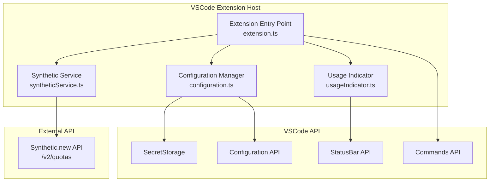
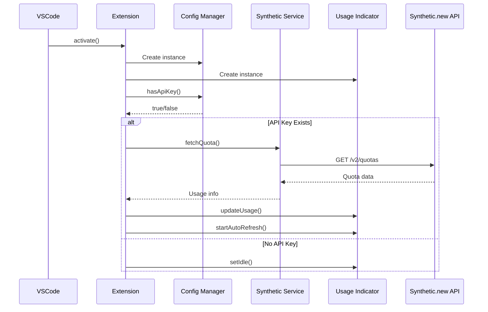
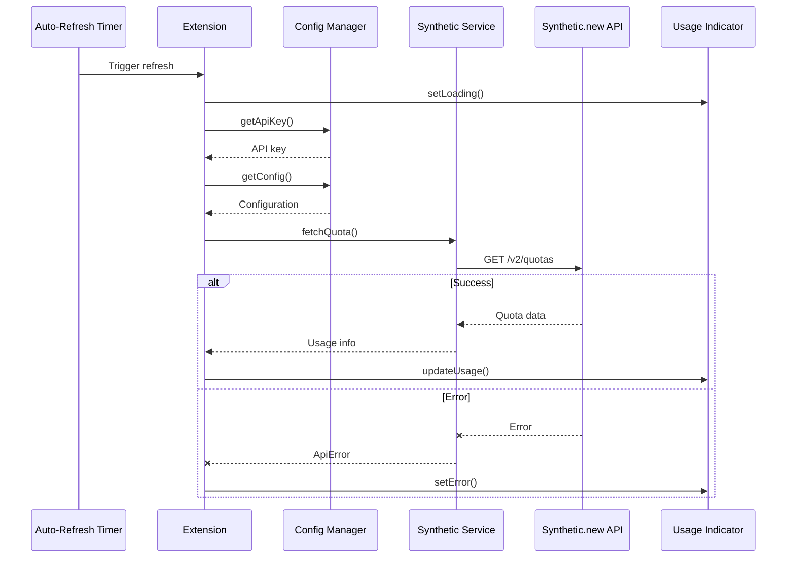
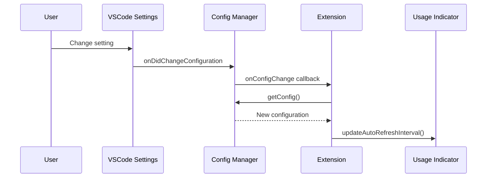

# Architecture

This document describes the architecture and design of the Synthetic.new Usage Tracker extension.

## System Overview

The extension is built as a VSCode extension using TypeScript. It follows a service-oriented architecture with clear separation of concerns.

## Architecture Diagram



## Components

### 1. Extension Entry Point (`extension.ts`)

The main entry point that coordinates all components:

- Initializes the extension on activation
- Registers commands with VSCode
- Manages the lifecycle of all components
- Handles configuration changes

**Key Responsibilities:**
- Extension activation and deactivation
- Command registration
- Component coordination
- Error handling at the top level

### 2. Configuration Manager (`config/configuration.ts`)

Manages extension configuration and secure storage:

- Reads configuration from VSCode settings
- Stores API keys securely using VSCode SecretStorage
- Watches for configuration changes
- Provides configuration to other components

**Key Responsibilities:**
- Configuration reading and validation
- Secure API key storage
- Configuration change notification
- Default value management

### 3. Synthetic Service (`api/syntheticService.ts`)

Handles all communication with the Synthetic.new API:

- Fetches quota information from the API
- Implements retry logic with exponential backoff
- Parses and validates API responses
- Handles API errors appropriately

**Key Responsibilities:**
- HTTP request management
- Retry logic with exponential backoff
- Error classification and handling
- Response parsing

**Error Handling:**
The service classifies errors into types:
- `Network`: Connection issues
- `Authentication`: Invalid API keys
- `RateLimit`: API rate limits exceeded
- `Server`: Server-side errors
- `Unknown`: Other errors

### 4. Usage Indicator (`statusBar/usageIndicator.ts`)

Manages the status bar UI:

- Displays usage information in the status bar
- Updates colors based on usage thresholds
- Shows tooltips with detailed information
- Manages auto-refresh timers

**Key Responsibilities:**
- Status bar item management
- Display state management
- Threshold checking
- Auto-refresh coordination

**Display States:**
- `Loading`: Fetching data
- `Idle`: No API key configured
- `Success`: Normal usage
- `Warning`: Above warning threshold
- `Critical`: Above critical threshold
- `Error`: API error occurred

## Data Flow

### Initialization Flow



### Refresh Flow



### Configuration Change Flow



## Design Patterns

### 1. Service-Oriented Architecture

Each component has a single, well-defined responsibility:
- Configuration management
- API communication
- UI display
- Extension coordination

### 2. Observer Pattern

Configuration changes are observed by components:

```typescript
configManager.onConfigChange(() => {
  // Handle configuration changes
});
```

### 3. Retry Pattern

API requests use exponential backoff for resilience:

```typescript
// Initial delay: 1s
// Retry 1: 2s
// Retry 2: 4s
// Max delay: 10s
```

### 4. State Machine

The usage indicator follows a state machine pattern:

```
Idle -> Loading -> Success/Warning/Critical/Error
           ^         |
           |_________|
```

## Security Considerations

### API Key Storage

- API keys are stored using VSCode SecretStorage
- Keys are encrypted at rest by the operating system
- Keys are never logged or exposed in error messages

### API Communication

- All API calls use HTTPS
- API keys are sent in the Authorization header
- No sensitive data is cached in memory longer than necessary

### Configuration

- API endpoint is configurable but validated
- Refresh interval has a minimum limit (10 seconds)
- All user input is validated

## Performance Considerations

### Auto-Refresh

- Configurable interval (default: 60 seconds)
- Can be disabled to reduce API calls
- Minimizes unnecessary API requests

### Error Handling

- Retry logic reduces failed requests
- Exponential backoff prevents overwhelming the API
- Graceful degradation on errors

### Resource Management

- All disposables are properly cleaned up
- Timers are cleared on deactivation
- No memory leaks

## Testing Strategy

Components are tested independently:

1. **Configuration Manager**: Test configuration reading and storage
2. **Synthetic Service**: Test API communication and retry logic
3. **Usage Indicator**: Test UI updates and state changes
4. **Extension**: Test integration of all components

## Future Enhancements

Potential areas for improvement:

1. **Caching**: Cache API responses to reduce redundant calls
2. **History**: Track usage over time for graphs/charts
3. **Multiple Keys**: Support multiple API keys
4. **Export/Import**: Allow exporting configuration
5. **Advanced Notifications**: More granular notification options
