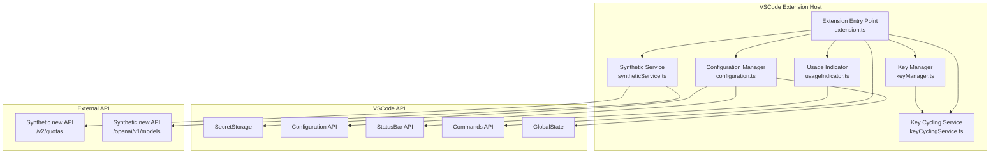
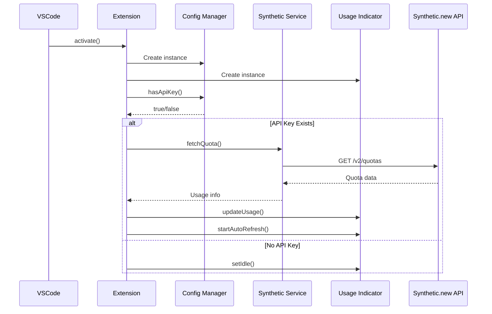
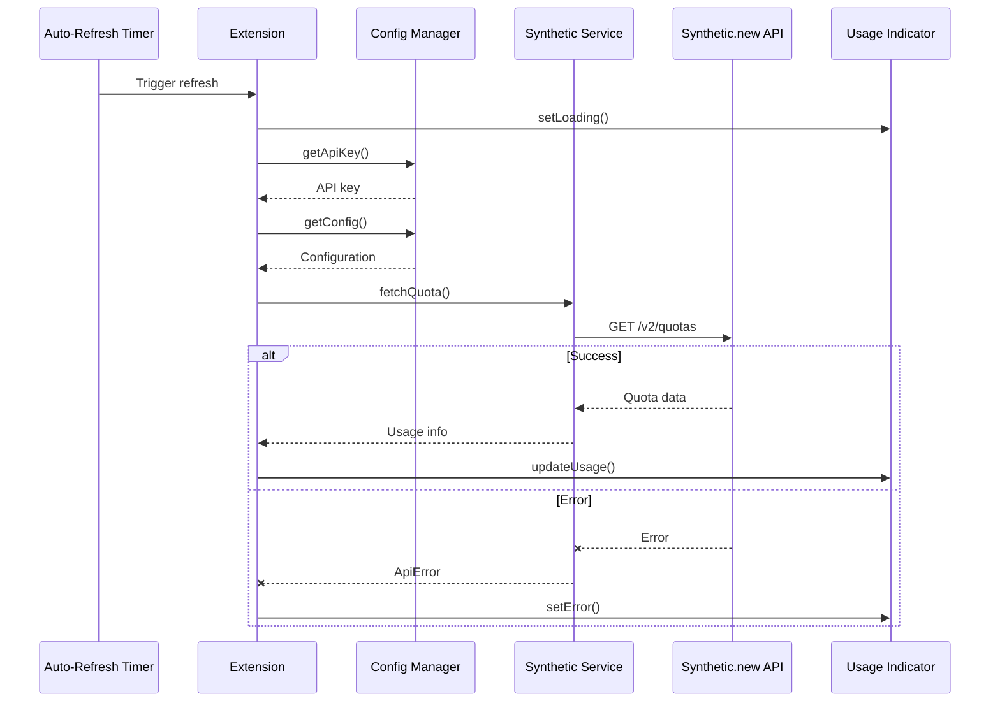
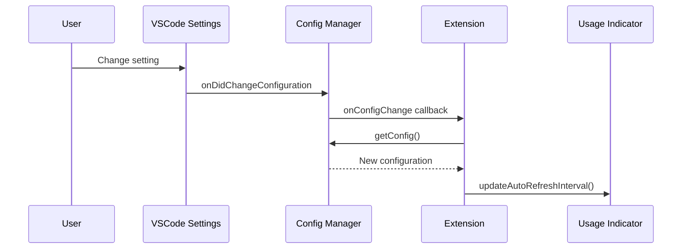
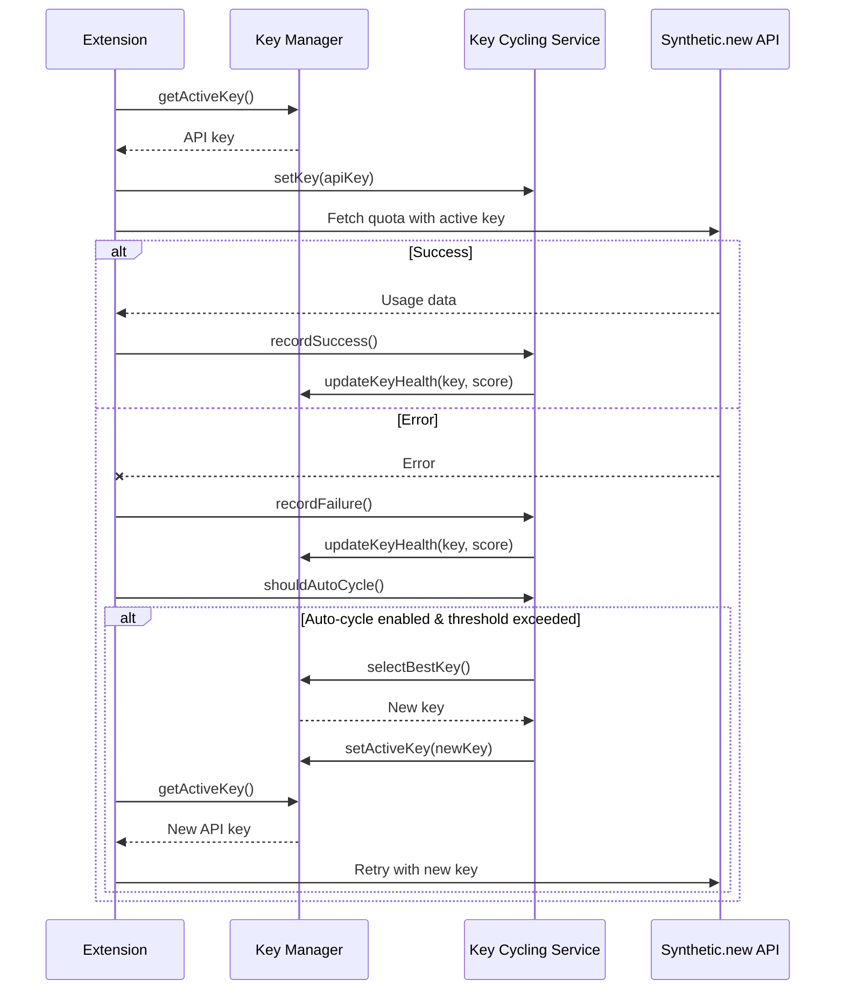
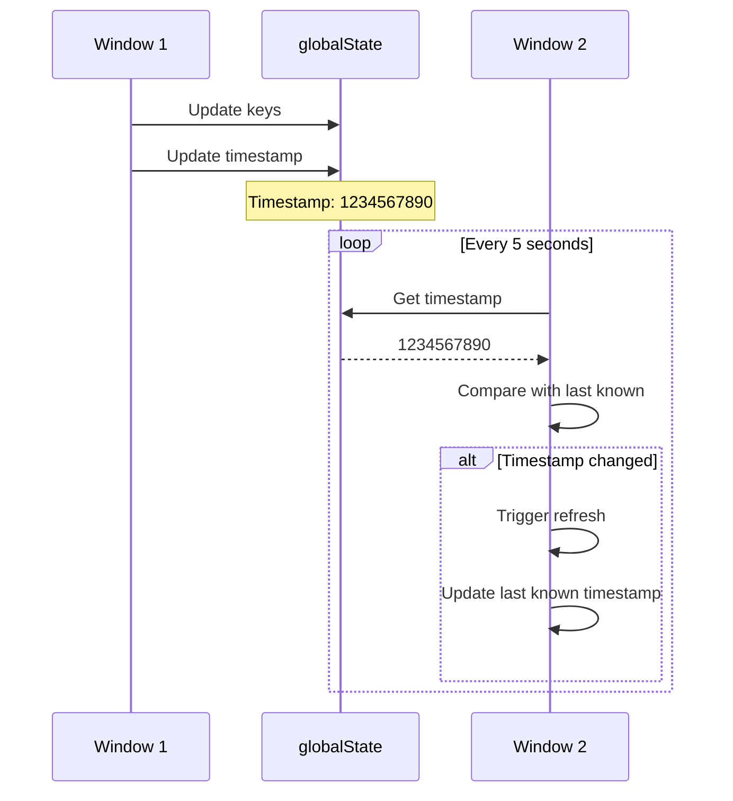

# Architecture

This document describes the architecture and design of the Synthetic.new Usage Tracker extension.

## System Overview

The extension is built as a VSCode extension using TypeScript. It follows a service-oriented architecture with clear separation of concerns.

## Architecture Diagram



## Components

### 1. Extension Entry Point (`extension.ts`)

The main entry point that coordinates all components:

- Initializes the extension on activation
- Registers commands with VSCode
- Manages the lifecycle of all components
- Handles configuration changes

**Key Responsibilities:**
- Extension activation and deactivation
- Command registration
- Component coordination
- Error handling at the top level

### 2. Configuration Manager (`config/configuration.ts`)

Manages extension configuration and secure storage:

- Reads configuration from VSCode settings
- Stores API keys securely using VSCode SecretStorage
- Watches for configuration changes
- Provides configuration to other components

**Key Responsibilities:**
- Configuration reading and validation
- Secure API key storage
- Configuration change notification
- Default value management

### 3. Synthetic Service (`api/syntheticService.ts`)

Handles all communication with the Synthetic.new API:

- Fetches quota information from the API
- Implements retry logic with exponential backoff
- Parses and validates API responses
- Handles API errors appropriately

**Key Responsibilities:**
- HTTP request management
- Retry logic with exponential backoff
- Error classification and handling
- Response parsing

**Error Handling:**
The service classifies errors into types:
- `Network`: Connection issues
- `Authentication`: Invalid API keys
- `RateLimit`: API rate limits exceeded
- `Server`: Server-side errors
- `Unknown`: Other errors

### 4. Usage Indicator (`statusBar/usageIndicator.ts`)

Manages the status bar UI:

- Displays usage information in the status bar
- Updates colors based on usage thresholds
- Shows tooltips with detailed information
- Manages auto-refresh timers
- Displays category breakdowns with ASCII progress bars
- Shows warning symbols for quota alerts
- Displays API key suffix in tooltips

**Key Responsibilities:**
- Status bar item management
- Display state management
- Threshold checking
- Auto-refresh coordination
- Tooltip content generation with visual indicators

**Display States:**
- `Loading`: Fetching data
- `Idle`: No API key configured
- `Success`: Normal usage
- `Warning`: Above warning threshold
- `Critical`: Above critical threshold
- `Error`: API error occurred

**Visual Features:**
- ASCII progress bars using Unicode block characters (█ for filled, ░ for empty)
- Quota warning symbols: ⚠️ for ≥80%, 🔴 for ≥90%
- Category-specific warnings with abbreviations (T=tools, S=search, C=chat, O=other)
- API key suffix display showing last 4 characters (format: `Key: ****x7b9`)

### 5. Key Manager (`config/keyManager.ts`)

Manages multiple API keys with labels and health tracking:

- Stores and retrieves multiple API keys securely
- Tracks key health scores (0-100)
- Monitors key usage statistics
- Provides cross-window synchronization
- Manages active key selection

**Key Responsibilities:**
- Secure storage of multiple API keys with labels
- Health tracking and scoring
- Usage statistics tracking
- Cross-window state synchronization
- Active key management

**Health Scoring System:**
- Base score: 100 for new keys
- Decrements on failures
- Considers quota availability
- Tracks usage patterns over time

**Cross-Window Synchronization:**
- Uses `globalState` for shared state
- Polling mechanism to detect changes from other windows
- Timestamp-based change detection
- Automatic refresh on key updates

### 6. Key Cycling Service (`api/keyCyclingService.ts`)

Provides automatic key cycling based on health and usage:

- Implements multiple cycling strategies
- Automatically selects the best key
- Manages key health updates
- Supports manual and automatic key cycling

**Key Responsibilities:**
- Key selection based on strategy
- Health score calculation
- Automatic key cycling
- Strategy management

**Cycling Strategies:**
- `RoundRobin`: Rotates through keys in order
- `LeastUsed`: Selects key with least usage
- `Random`: Randomly selects a key
- `Priority`: Selects key with highest priority

**Health Calculation Factors:**
- Failure count
- Quota availability
- Usage patterns
- Last successful request time

## Data Flow

### Initialization Flow



### Refresh Flow



### Configuration Change Flow



### Key Cycling Flow



### Cross-Window Synchronization Flow



## Multi-Key Cycling Architecture

### Overview

The multi-key cycling architecture enables the extension to automatically manage and rotate between multiple API keys, providing improved reliability and load distribution. This system consists of two main components:

1. **Key Manager** ([`src/config/keyManager.ts`](src/config/keyManager.ts)) - Manages storage, retrieval, and health tracking of multiple API keys
2. **Key Cycling Service** ([`src/api/keyCyclingService.ts`](src/api/keyCyclingService.ts)) - Implements cycling strategies and automatic key selection logic

### Key Components

#### Key Manager

The Key Manager is responsible for:

- **Secure Storage**: Stores multiple API keys with labels using VSCode's SecretStorage
- **Health Tracking**: Maintains health scores (0-100) for each key based on usage patterns
- **Cross-Window Synchronization**: Uses `globalState` with polling to synchronize key state across multiple VSCode windows
- **Active Key Management**: Tracks and updates the currently active key
- **Usage Statistics**: Records request counts and failure rates for each key

**Design decision: Health scoring system**

The health scoring system provides a quantitative measure of key reliability:
- Base score: 100 for new keys
- Decrements by 10 points on each failure
- Adds bonus points for high quota availability
- Decays over time to reflect stale data
- Minimum score: 0, maximum score: 100

```
health = 100 - (failures * 10) + quotaBonus - usageDecay
```

This system allows the extension to prioritize healthier keys while still providing opportunities for recovery.

#### Key Cycling Service

The Key Cycling Service implements:

- **Multiple Cycling Strategies**: Four algorithms for selecting the next key
- **Automatic Key Cycling**: Automatically switches keys when thresholds are exceeded
- **Health-Based Selection**: Prioritizes keys with higher health scores
- **Strategy Management**: Allows runtime switching between cycling strategies

### Cycling Strategies

The extension supports four cycling strategies:

#### 1. RoundRobin

Rotates through keys in sequential order, ensuring even distribution regardless of health.

**Use case**: Simple load balancing when all keys are equally reliable.

#### 2. LeastUsed

Selects the key with the lowest request count, balancing load based on actual usage.

**Use case**: Distributing load when keys have different rate limits or quotas.

#### 3. Random

Randomly selects a key, providing simple unpredictability.

**Use case**: Basic load distribution without complex logic.

#### 4. Priority

Selects the key with the highest health score, prioritizing reliability.

**Use case**: Maximizing success rate when keys have varying reliability.

### Auto-Cycle Logic

Automatic key cycling occurs when:

1. **Threshold Exceeded**: The active key's usage exceeds the configured threshold
2. **Health Degraded**: The active key's health score falls below acceptable levels
3. **Failures Occur**: Repeated failures indicate key issues

**Auto-cycle process:**

1. Check if auto-cycling is enabled in configuration
2. Evaluate if cycling conditions are met (threshold or health)
3. Select the best key using the configured strategy
4. Update the active key in Key Manager
5. Refresh usage data with the new key

### Cross-Window Synchronization

The cross-window synchronization mechanism ensures key state consistency across multiple VSCode windows:

**Implementation:**

1. **Timestamp Tracking**: Each key update records a timestamp in `globalState`
2. **Polling Mechanism**: Each window polls the timestamp every 5 seconds
3. **Change Detection**: Windows compare their local timestamp with the global timestamp
4. **Automatic Refresh**: When a change is detected, the window refreshes its key list

**Design decision: Polling vs. Event-Based**

VSCode's `globalState` doesn't support change events across windows. Polling every 5 seconds provides:
- Adequate responsiveness for key updates
- Minimal performance impact
- Simple implementation without external dependencies

Alternative considered: Use workspace state with `onDidChangeConfiguration`
Rejected: Configuration events don't fire for `globalState` changes, only for workspace configuration changes.

### Configuration Options

Three new configuration options control multi-key cycling:

| Configuration | Type | Default | Description |
|--------------|------|---------|-------------|
| `enableKeyCycling` | boolean | false | Enable automatic key cycling |
| `cyclingStrategy` | string | "RoundRobin" | Key selection strategy (RoundRobin, LeastUsed, Random, Priority) |
| `autoCycleThreshold` | number | 90 | Usage percentage threshold for auto-cycling |

### Commands

Six new commands provide manual control over key management:

| Command | Description |
|---------|-------------|
| `syntheticUsageTracker.addKey` | Add a new API key with optional label |
| `syntheticUsageTracker.removeKey` | Remove an API key by index |
| `syntheticUsageTracker.selectKey` | Manually select an active key |
| `syntheticUsageTracker.cycleKeys` | Manually cycle to the next key |
| `syntheticUsageTracker.listKeys` | Display all configured keys with health scores |
| `syntheticUsageTracker.resetStatistics` | Reset usage statistics for all keys |

### Design Decisions

#### Health Scoring Formula

**Decision**: Use a weighted formula that considers failures, quota availability, and usage patterns

**Rationale**:
- Failures are the most important indicator of key health (weight: -10 per failure)
- Quota availability provides context for long-term viability
- Usage decay prevents stale data from misleading the system

**Alternative considered**: Use only failure count
Rejected: Doesn't account for quota availability or usage patterns, leading to suboptimal key selection.

#### Polling Interval

**Decision**: Poll every 5 seconds for cross-window synchronization

**Rationale**:
- Provides responsive updates without excessive polling
- Balances performance and responsiveness
- Aligns with typical user expectations for cross-window updates

**Alternative considered**: Poll every 1 second
Rejected: Would provide more responsive updates but at the cost of higher CPU usage and potential performance degradation.

#### Strategy Enumeration

**Decision**: Use TypeScript enum for cycling strategies

**Rationale**:
- Provides compile-time type safety
- Enables IDE autocomplete
- Makes refactoring easier with automated tooling

**Alternative considered**: Use string literals
Rejected: No type safety, prone to typos, harder to refactor.

### Integration with Existing Components

The multi-key cycling architecture integrates seamlessly with existing components:

- **Configuration Manager**: Provides new configuration options and watches for changes
- **Synthetic Service**: Creates new instances for each API request with the active key
- **Usage Indicator**: Displays health information in tooltips (optional)
- **Extension**: Coordinates key cycling with usage refresh cycles

### Error Handling

The multi-key cycling system includes robust error handling:

1. **Key Selection Failures**: Fallback to the first available key if selection fails
2. **Storage Errors**: Gracefully degrade to single-key mode if storage fails
3. **Synchronization Errors**: Log errors but continue operation with local state
4. **Health Calculation Errors**: Use default health score (100) on calculation errors

### Performance Considerations

The multi-key cycling architecture is designed for minimal performance impact:

- **Lazy Loading**: Keys are loaded on-demand, not at startup
- **Efficient Polling**: 5-second interval balances responsiveness and performance
- **Cached Health Scores**: Health scores are cached and only updated on events
- **Minimal Storage**: Only essential data is stored in `globalState`

## Design Patterns

### 1. Service-Oriented Architecture

Each component has a single, well-defined responsibility:
- Configuration management
- API communication
- UI display
- Extension coordination

### 2. Observer Pattern

Configuration changes are observed by components:

```typescript
configManager.onConfigChange(() => {
  // Handle configuration changes
});
```

### 3. Retry Pattern

API requests use exponential backoff for resilience:

```typescript
// Initial delay: 1s
// Retry 1: 2s
// Retry 2: 4s
// Max delay: 10s
```

### 4. State Machine

The usage indicator follows a state machine pattern:

```
Idle -> Loading -> Success/Warning/Critical/Error
           ^         |
           |_________|
```

## Security Considerations

### API Key Storage

- API keys are stored using VSCode SecretStorage
- Keys are encrypted at rest by the operating system
- Keys are never logged or exposed in error messages

### API Communication

- All API calls use HTTPS
- API keys are sent in the Authorization header
- No sensitive data is cached in memory longer than necessary

### Configuration

- API endpoint is configurable but validated
- Refresh interval has a minimum limit (10 seconds)
- All user input is validated

## Performance Considerations

### Auto-Refresh

- Configurable interval (default: 60 seconds)
- Can be disabled to reduce API calls
- Minimizes unnecessary API requests

### Error Handling

- Retry logic reduces failed requests
- Exponential backoff prevents overwhelming the API
- Graceful degradation on errors

### Resource Management

- All disposables are properly cleaned up
- Timers are cleared on deactivation
- No memory leaks

## Testing Strategy

Components are tested independently:

1. **Configuration Manager**: Test configuration reading and storage
2. **Synthetic Service**: Test API communication and retry logic
3. **Usage Indicator**: Test UI updates and state changes
4. **Extension**: Test integration of all components

## Future Enhancements

Potential areas for improvement:

1. **Caching**: Cache API responses to reduce redundant calls
2. **History**: Track usage over time for graphs/charts
3. **Multiple Keys**: Support multiple API keys
4. **Export/Import**: Allow exporting configuration
5. **Advanced Notifications**: More granular notification options
