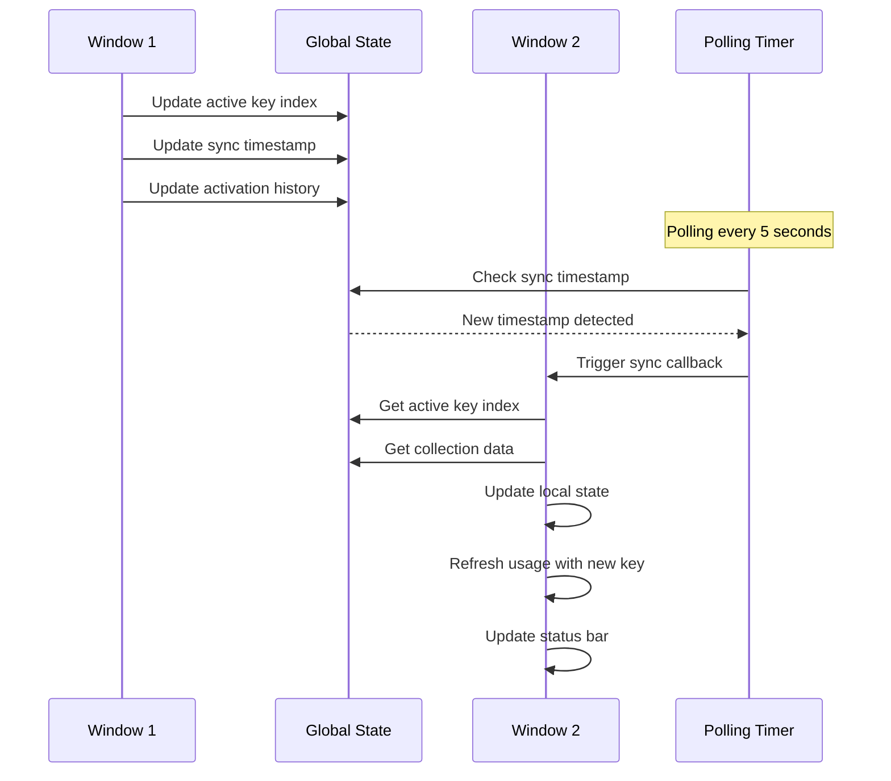

# Multi-Key Cycling Architecture

## Overview

This document describes the architecture for supporting multiple API keys with automatic cycling functionality in the Synthetic Usage Tracker extension. This design enables users to configure multiple Synthetic.new API keys and automatically cycle through them when quotas are exceeded or keys fail.

## Design Goals

1. **Backward Compatibility**: Existing single-key users should not experience any disruption
2. **User Control**: Users should have both automatic and manual key cycling options
3. **Transparency**: Users should always know which key is currently active
4. **Resilience**: The extension should gracefully handle key failures and quota exhaustion
5. **Security**: Multiple keys should be stored securely using VSCode SecretStorage
6. **Cross-Window Sync**: Key state should synchronize across multiple VSCode windows

## Data Structures

### API Key Entry

```typescript
/**
 * Represents a single API key entry with metadata
 */
interface ApiKeyEntry {
  /** The actual API key (secret) */
  key: string;
  /** User-provided label for easy identification */
  label: string;
  /** Timestamp when this key was added */
  addedAt: number;
  /** Whether this key is currently active */
  isActive: boolean;
  /** Usage statistics for this key */
  statistics: KeyStatistics;
}

/**
 * Usage statistics for a specific API key
 */
interface KeyStatistics {
  /** Number of times this key has been used */
  usageCount: number;
  /** Last known quota information */
  lastQuota: {
    limit: number;
    requests: number;
    remaining: number;
    percentageUsed: number;
    renewsAt: string;
  } | null;
  /** Timestamp of last successful API call */
  lastUsedAt: number | null;
  /** Number of consecutive failures */
  failureCount: number;
  /** Timestamp of last failure */
  lastFailureAt: number | null;
}
```

### Key Collection

```typescript
/**
 * Collection of API keys with cycling state
 */
interface ApiKeyCollection {
  /** Array of stored API keys */
  keys: ApiKeyEntry[];
  /** Configuration for key cycling behavior */
  cyclingConfig: CyclingConfig;
  /** Timestamp of last modification */
  modifiedAt: number;
}

/**
 * Configuration for automatic key cycling behavior
 */
interface CyclingConfig {
  /** Whether automatic cycling is enabled */
  enabled: boolean;
  /** Cycling strategy to use */
  strategy: CyclingStrategy;
  /** Threshold percentage at which to cycle to next key */
  cycleThreshold: number;
  /** Maximum number of consecutive failures before marking key as unhealthy */
  maxFailures: number;
  /** Whether to skip unhealthy keys during cycling */
  skipUnhealthy: boolean;
}

/**
 * Strategy for selecting the next key during cycling
 */
enum CyclingStrategy {
  /** Use keys in round-robin order */
  RoundRobin = "roundRobin",
  /** Always use the key with the most remaining quota */
  LeastUsed = "leastUsed",
  /** Randomly select from available keys */
  Random = "random",
  /** Use keys in priority order (user-defined) */
  Priority = "priority",
}
```

### Key Cycling State

```typescript
/**
 * Runtime state for key cycling (stored in globalState)
 */
interface KeyCyclingState {
  /** Index of currently active key */
  activeKeyIndex: number;
  /** Timestamp when current key was activated */
  activatedAt: number;
  /** History of key activations for analytics */
  activationHistory: ActivationHistoryEntry[];
  /** Health status of each key */
  keyHealth: number[];
}

/**
 * Entry in the activation history
 */
interface ActivationHistoryEntry {
  /** Key index that was activated */
  keyIndex: number;
  /** Timestamp of activation */
  activatedAt: number;
  /** Reason for activation */
  reason: ActivationReason;
}

/**
 * Reason why a key was activated
 */
enum ActivationReason {
  /** Initial activation */
  Initial = "initial",
  /** User manually selected the key */
  ManualSelection = "manualSelection",
  /** Previous key exceeded quota threshold */
  QuotaExceeded = "quotaExceeded",
  /** Previous key failed authentication */
  AuthenticationFailed = "authenticationFailed",
  /** Previous key experienced consecutive failures */
  TooManyFailures = "tooManyFailures",
  /** Previous key was removed */
  KeyRemoved = "keyRemoved",
  /** Cross-window synchronization update */
  CrossWindowSync = "crossWindowSync",
}

/**
 * Health status of a key (0-100, higher is healthier)
 */
type KeyHealth = number;
```

## Key Cycling Logic

### Selection Strategies

#### 1. Round-Robin Cycling

**Description**: Keys are used in sequential order, wrapping around at the end.

**Algorithm**:
```
nextIndex = (currentIndex + 1) % keys.length
```

**Pros**:
- Simple and predictable
- Fair distribution of usage across all keys
- Easy to understand

**Cons**:
- Doesn't consider actual quota availability
- May cycle to a key with low quota

**Use Case**: When all keys have similar quotas and usage patterns

#### 2. Least-Used Cycling

**Description**: Always select the key with the most remaining quota.

**Algorithm**:
```
nextIndex = argmax(keys[i].statistics.lastQuota.remaining)
```

**Pros**:
- Maximizes total available quota
- Natural load balancing

**Cons**:
- Requires fresh quota data for all keys
- May cause uneven usage distribution
- More complex to implement

**Use Case**: When keys have different quotas and usage levels

#### 3. Random Cycling

**Description**: Randomly select from available keys.

**Algorithm**:
```
nextIndex = random(0, keys.length - 1)
```

**Pros**:
- Simple to implement
- Unpredictable (can be beneficial for rate limiting)

**Cons**:
- No fairness guarantee
- May select unhealthy keys
- Difficult to debug

**Use Case**: When keys have identical quotas and no preference needed

#### 4. Priority Cycling

**Description**: Keys are ordered by user-defined priority, always use highest priority available.

**Algorithm**:
```
nextIndex = first key where key.isHealthy && key.hasRemainingQuota
```

**Pros**:
- User control over key selection
- Predictable behavior

**Cons**:
- Lower priority keys may never be used
- Manual management required

**Use Case**: When keys have different tiers or purposes (e.g., production vs testing)

### Cycling Triggers

#### Automatic Cycling Triggers

1. **Quota Threshold Exceeded**
   - When current key's `percentageUsed` exceeds `cycleThreshold`
   - Default threshold: 90%
   - Configurable via settings

2. **Authentication Failure**
   - When API returns 401 or 403 status
   - Immediate cycling to next key
   - Mark failed key as unhealthy

3. **Consecutive Failures**
   - When `failureCount` exceeds `maxFailures`
   - Default: 3 consecutive failures
   - Mark key as unhealthy and cycle to next

4. **No Subscription**
   - When API returns no subscription data
   - Cycle to next key
   - Mark current key as requiring attention

#### Manual Cycling Triggers

1. **User Command**: `syntheticUsageTracker.cycleKey`
   - Immediately cycle to next key
   - Record activation reason as `ManualSelection`

2. **User Command**: `syntheticUsageTracker.selectKey`
   - Show quick pick with all keys
   - Allow user to select specific key
   - Record activation reason as `ManualSelection`

3. **User Command**: `syntheticUsageTester.refreshCurrentKey`
   - Refresh quota for current key without cycling
   - Useful for checking if quota has renewed

### Key Health Management

#### Health Status Calculation

```typescript
/**
 * Calculate health score for a key (0-100)
 * Factors: recent failures, quota availability, age
 */
function calculateKeyHealth(key: ApiKeyEntry): number {
  let health = 100;

  // Penalize for consecutive failures
  health -= key.statistics.failureCount * 20;

  // Penalize for low remaining quota
  if (key.statistics.lastQuota) {
    const remainingRatio = key.statistics.lastQuota.remaining / 
                          key.statistics.lastQuota.limit;
    health -= (1 - remainingRatio) * 30;
  }

  // Small penalty for keys not used recently (potential staleness)
  if (key.statistics.lastUsedAt) {
    const daysSinceLastUse = (Date.now() - key.statistics.lastUsedAt) / 
                            (1000 * 60 * 60 * 24);
    if (daysSinceLastUse > 7) {
      health -= Math.min(daysSinceLastUse, 10);
    }
  }

  return Math.max(0, Math.min(100, health));
}
```

#### Unhealthy Key Handling

- Keys with health < 50 are considered unhealthy
- Unhealthy keys are skipped during automatic cycling (if `skipUnhealthy` is enabled)
- Users can manually select unhealthy keys if needed
- Health recovers over time as failures age out

## Persistence Strategy

### Storage Locations

#### SecretStorage (Secure)

```typescript
// Stored in VSCode SecretStorage (encrypted)
const SECRET_KEYS = {
  // Array of API keys with metadata
  API_KEY_COLLECTION = "syntheticApiKeyCollection",
} as const;
```

**Rationale**: API keys are sensitive data that must be encrypted at rest.

#### GlobalState (Shared Across Windows)

```typescript
// Stored in VSCode globalState (not encrypted, shared)
const SHARED_STATE_KEYS = {
  // Current active key index
  ACTIVE_KEY_INDEX = "syntheticActiveKeyIndex",
  // Timestamp of last key activation
  KEY_ACTIVATED_AT = "syntheticKeyActivatedAt",
  // Timestamp of last collection modification
  COLLECTION_MODIFIED_AT = "syntheticCollectionModifiedAt",
  // Activation history (limited to last 100 entries)
  ACTIVATION_HISTORY = "syntheticActivationHistory",
  // Key health scores
  KEY_HEALTH = "syntheticKeyHealth",
  // Timestamp for cross-window synchronization
  SYNC_TIMESTAMP = "syntheticKeySyncTimestamp",
} as const;
```

**Rationale**: Runtime state needs to be shared across windows but doesn't contain secrets.

### Migration Path

#### Single Key to Multi-Key Migration

**Scenario**: User has existing single key in legacy format.

**Migration Steps**:
1. On extension activation, check for legacy key format
2. If legacy key exists:
   - Create new `ApiKeyCollection` with single entry
   - Set label to "Imported Key"
   - Set `addedAt` to current timestamp
   - Mark as active
   - Delete legacy format to avoid duplicate storage
3. Store new format
4. Notify user of successful migration (optional)

**Code Example**:
```typescript
async migrateLegacyKey(): Promise<void> {
  const legacyKey = await this.context.secrets.get("syntheticApiKey");
  if (legacyKey) {
    const collection: ApiKeyCollection = {
      keys: [{
        key: legacyKey,
        label: "Imported Key",
        addedAt: Date.now(),
        isActive: true,
        statistics: {
          usageCount: 0,
          lastQuota: null,
          lastUsedAt: null,
          failureCount: 0,
          lastFailureAt: null,
        },
      }],
      cyclingConfig: DEFAULT_CYCLING_CONFIG,
      modifiedAt: Date.now(),
    };
    
    await this.context.secrets.store(
      SECRET_KEYS.API_KEY_COLLECTION,
      JSON.stringify(collection)
    );
    
    await this.context.secrets.delete("syntheticApiKey");
  }
}
```

### Data Validation

**On Load**:
- Validate JSON structure
- Ensure at least one key exists
- Validate each key format with `SyntheticService.validateApiKey()`
- Ensure exactly one key is marked as active
- If no active key, mark first key as active
- If multiple active keys, keep first, deactivate others

**On Save**:
- Validate all keys before saving
- Ensure collection has at least one key
- Ensure exactly one key is active
- Update `modifiedAt` timestamp

## User Interface Design

### Commands

#### Key Management Commands

| Command ID | Title | Description |
|------------|-------|-------------|
| `syntheticUsageTracker.manageKeys` | Manage API Keys | Open key management interface |
| `syntheticUsageTracker.addKey` | Add API Key | Add a new API key with label |
| `syntheticUsageTracker.removeKey` | Remove API Key | Remove an existing API key |
| `syntheticUsageTracker.editKeyLabel` | Edit Key Label | Change the label for an existing key |
| `syntheticUsageTester.cycleKey` | Cycle to Next Key | Manually cycle to the next available key |
| `syntheticUsageTracker.selectKey` | Select Active Key | Choose which key to make active |
| `syntheticUsageTracker.showKeyDetails` | Show Key Details | Display detailed information for current key |
| `syntheticUsageTracker.refreshCurrentKey` | Refresh Current Key | Refresh quota for currently active key |

### Key Management Interface

#### Quick Pick for Key Selection

```
┌─────────────────────────────────────────┐
│ Select API Key                          │
├─────────────────────────────────────────┤
│ $(check) Production Key (syn_...7f3a)   │
│         85% used • 20/135 remaining     │
│                                         │
│         Development Key (syn_...8b2c)   │
│         12% used • 119/135 remaining    │
│                                         │
│         Test Key (syn_...1d4e)          │
│         0% used • 135/135 remaining     │
│                                         │
│         ─────────────────────────       │
│         Add New Key...                  │
│         Manage Keys...                  │
└─────────────────────────────────────────┘
```

#### Add Key Dialog

```
┌─────────────────────────────────────────┐
│ Add API Key                             │
├─────────────────────────────────────────┤
│ Label: Production Key                   │
│                                         │
│ API Key: ••••••••••••••••••••••••       │
│                                         │
│ [Cancel]              [Add Key]         │
└─────────────────────────────────────────┘
```

#### Key Details View

```
┌─────────────────────────────────────────┐
│ API Key Details                         │
├─────────────────────────────────────────┤
│ Label: Production Key                   │
│ Key: syn_...7f3a                        │
│                                         │
│ Usage Statistics                        │
│ • Used: 115/135 (85%)                  │
│ • Remaining: 20                         │
│ • Renews at: 2026-01-31 14:36:14 UTC   │
│                                         │
│ Health Score: 72/100                    │
│ • Total Usage: 1,234 requests           │
│ • Failures: 2 consecutive              │
│ • Last Used: 2 minutes ago              │
│                                         │
│ [Refresh]  [Edit Label]  [Remove]       │
└─────────────────────────────────────────┘
```

### Status Bar Display

#### Single Key Mode (Current - Backward Compatible)

```
┌─────────────────────────────────────────┐
│ Synthetic.new 85% (syn_...7f3a)         │
└─────────────────────────────────────────┘
```

#### Multi-Key Mode

```
┌─────────────────────────────────────────┐
│ Synthetic.new 85% (1/3) • Production    │
└─────────────────────────────────────────┘
```

**Status Bar Components**:
- **Icon**: Synthetic.new icon
- **Usage**: Current usage percentage (85%)
- **Key Index**: Active key position (1/3 means key 1 of 3)
- **Label**: User-provided label for active key (truncated if too long)
- **Key Suffix**: Last 4 characters of key for identification

#### Tooltip Content

**Single Key Mode**:
```
Synthetic.new Usage
━━━━━━━━━━━━━━━━━━━━━━━━━━━━━━
Key: ****7f3a
Usage: 85% (115/135)
Remaining: 20 requests
Renews at: Jan 31, 2026 14:36 UTC

[Refresh] [Configure] [Cycle Keys]
```

**Multi-Key Mode**:
```
Synthetic.new Usage
━━━━━━━━━━━━━━━━━━━━━━━━━━━━━━
Active Key: Production (****7f3a)
Usage: 85% (115/135)
Remaining: 20 requests
Renews at: Jan 31, 2026 14:36 UTC

All Keys:
━━━━━━━━━━━━━━━━━━━━━━━━━━━━━━
$(check) Production (1/3): 85% used
         Development (2/3): 12% used
         Test (3/3): 0% used

[Refresh] [Manage Keys] [Cycle Keys]
```

### Configuration Options

Add new configuration properties to [`package.json`](package.json):

```json
{
  "syntheticUsageTracker.enableKeyCycling": {
    "type": "boolean",
    "default": true,
    "description": "Enable automatic key cycling when quota is exceeded"
  },
  "syntheticUsageTracker.cyclingStrategy": {
    "type": "string",
    "enum": ["roundRobin", "leastUsed", "random", "priority"],
    "default": "roundRobin",
    "description": "Strategy for selecting next key during cycling"
  },
  "syntheticUsageTracker.cycleThreshold": {
    "type": "number",
    "default": 90,
    "minimum": 50,
    "maximum": 100,
    "description": "Usage percentage threshold for automatic key cycling"
  },
  "syntheticUsageTracker.maxKeyFailures": {
    "type": "number",
    "default": 3,
    "minimum": 1,
    "maximum": 10,
    "description": "Maximum consecutive failures before marking key as unhealthy"
  },
  "syntheticUsageTracker.skipUnhealthyKeys": {
    "type": "boolean",
    "default": true,
    "description": "Skip unhealthy keys during automatic cycling"
  },
  "syntheticUsageTracker.showKeyIndex": {
    "type": "boolean",
    "default": true,
    "description": "Show key index in status bar when using multiple keys"
  },
  "syntheticUsageTracker.showKeyLabel": {
    "type": "boolean",
    "default": true,
    "description": "Show key label in status bar when using multiple keys"
  }
}
```

## Cross-Window Synchronization

### Synchronization Strategy

**Design Decision**: Use the existing polling-based approach for cross-window synchronization, extending it to handle key cycling state changes.

**Rationale**: 
- VSCode's globalState doesn't support change events across windows
- Polling every 5 seconds provides a good balance between responsiveness and performance
- Consistent with existing key update synchronization
- Minimal additional complexity

### Synchronization Data

Extend the existing shared state keys:

```typescript
const SHARED_STATE_KEYS = {
  // Existing keys
  KEY_UPDATE_TIMESTAMP: 'syntheticApiKeyUpdateTimestamp',
  
  // New keys for multi-key cycling
  COLLECTION_MODIFIED_AT: 'syntheticCollectionModifiedAt',
  ACTIVE_KEY_INDEX: 'syntheticActiveKeyIndex',
  KEY_ACTIVATED_AT: 'syntheticKeyActivatedAt',
  SYNC_TIMESTAMP: 'syntheticKeySyncTimestamp',
  
  // Activation history (limited to last 100 entries)
  ACTIVATION_HISTORY: 'syntheticActivationHistory',
  
  // Key health scores
  KEY_HEALTH: 'syntheticKeyHealth',
} as const;
```

### Synchronization Flow



### Conflict Resolution

**Scenario**: Two windows attempt to change the active key simultaneously.

**Resolution Strategy**:
1. Use timestamp-based "last write wins" approach
2. Each window includes its activation timestamp when updating
3. When a window detects a change from another window:
   - Compare timestamps
   - If other window's change is newer, accept it
   - If local change is newer, re-apply it (write back to globalState)
4. Add small delay (50ms) before writing to reduce collision probability

**Implementation Example**:
```typescript
async setActiveKeyIndex(index: number, reason: ActivationReason): Promise<void> {
  const timestamp = Date.now();
  
  // Update local state first
  this.activeKeyIndex = index;
  this.keyActivatedAt = timestamp;
  
  // Record activation in history
  this.addToActivationHistory(index, reason, timestamp);
  
  // Update global state with timestamp
  await this.context.globalState.update(SHARED_STATE_KEYS.ACTIVE_KEY_INDEX, index);
  await this.context.globalState.update(SHARED_STATE_KEYS.KEY_ACTIVATED_AT, timestamp);
  await this.context.globalState.update(SHARED_STATE_KEYS.SYNC_TIMESTAMP, timestamp);
}
```

### Synchronization Handlers

#### On Key Collection Changed

When keys are added, removed, or modified:

```typescript
async handleCollectionChanged(): Promise<void> {
  const modifiedAt = await this.context.globalState.get<number>(
    SHARED_STATE_KEYS.COLLECTION_MODIFIED_AT
  );
  
  if (modifiedAt && modifiedAt > this.lastKnownCollectionModifiedAt) {
    this.lastKnownCollectionModifiedAt = modifiedAt;
    
    // Reload key collection
    await this.loadKeyCollection();
    
    // Re-validate active key index
    await this.validateActiveKeyIndex();
    
    // Refresh usage
    await this.refreshUsage();
    
    // Notify user if enabled
    const config = this.configManager.getConfig();
    if (config.enableNotifications) {
      vscode.window.showInformationMessage(
        "API keys updated in another window."
      );
    }
  }
}
```

#### On Active Key Changed

When another window changes the active key:

```typescript
async handleActiveKeyChanged(): Promise<void> {
  const syncTimestamp = await this.context.globalState.get<number>(
    SHARED_STATE_KEYS.SYNC_TIMESTAMP
  );
  
  if (syncTimestamp && syncTimestamp > this.lastKnownSyncTimestamp) {
    const otherWindowTimestamp = await this.context.globalState.get<number>(
      SHARED_STATE_KEYS.KEY_ACTIVATED_AT
    );
    
    // Only accept if other window's change is newer
    if (otherWindowTimestamp && otherWindowTimestamp > this.keyActivatedAt) {
      this.lastKnownSyncTimestamp = syncTimestamp;
      this.keyActivatedAt = otherWindowTimestamp;
      
      // Get new active key index
      const newActiveIndex = await this.context.globalState.get<number>(
        SHARED_STATE_KEYS.ACTIVE_KEY_INDEX
      );
      
      if (newActiveIndex !== undefined) {
        this.activeKeyIndex = newActiveIndex;
        
        // Load activation history
        await this.loadActivationHistory();
        
        // Refresh usage with new key
        await this.refreshUsage();
        
        // Notify user if enabled
        const config = this.configManager.getConfig();
        if (config.enableNotifications) {
          vscode.window.showInformationMessage(
            "Active key changed in another window."
          );
        }
      }
    }
  }
}
```

## Implementation Steps

### Phase 1: Data Structures and Storage

1. **Create TypeScript interfaces** in new file [`src/types/keys.ts`](src/types/keys.ts):
   - `ApiKeyEntry`
   - `KeyStatistics`
   - `ApiKeyCollection`
   - `CyclingConfig`
   - `KeyCyclingState`
   - `ActivationHistoryEntry`
   - Enums: `CyclingStrategy`, `ActivationReason`

2. **Create key manager class** in new file [`src/keyManager/keyManager.ts`](src/keyManager/keyManager.ts):
   - `ApiKeyManager` class
   - Methods: `loadCollection()`, `saveCollection()`, `loadState()`, `saveState()`
   - Migration logic for legacy single-key format
   - Validation methods for data integrity

3. **Update configuration manager** in [`src/config/configuration.ts`](src/config/configuration.ts):
   - Add methods: `getApiKeyCollection()`, `saveApiKeyCollection()`
   - Add methods: `getKeyCyclingState()`, `saveKeyCyclingState()`
   - Update existing `getApiKey()` to return active key from collection
   - Update `setApiKey()` to add to collection or update existing key

### Phase 2: Key Cycling Logic

4. **Create cycling service** in new file [`src/cycling/cyclingService.ts`](src/cycling/cyclingService.ts):
   - `CyclingService` class
   - Methods: `selectNextKey()`, `selectKeyByIndex()`, `calculateKeyHealth()`
   - Implement all cycling strategies (round-robin, least-used, random, priority)
   - Handle automatic cycling triggers (quota exceeded, failures, etc.)
   - Track activation history

5. **Update extension** in [`src/extension.ts`](src/extension.ts):
   - Integrate `ApiKeyManager` and `CyclingService`
   - Update `refreshUsage()` to use cycling service
   - Add key cycling error handling
   - Update status bar to show multi-key information

### Phase 3: User Interface

6. **Register new commands** in [`src/extension.ts`](src/extension.ts):
   - `manageKeys`
   - `addKey`
   - `removeKey`
   - `editKeyLabel`
   - `cycleKey`
   - `selectKey`
   - `showKeyDetails`
   - `refreshCurrentKey`

7. **Implement command handlers**:
   - Create quick pick UI for key selection
   - Create input dialogs for adding/editing keys
   - Create key details view
   - Implement key management actions

8. **Update status bar** in [`src/statusBar/usageIndicator.ts`](src/statusBar/usageIndicator.ts):
   - Update `updateUsage()` to accept key index and label
   - Add multi-key display mode
   - Update tooltip to show all keys
   - Add key cycling indicator

9. **Update package.json**:
   - Add new command definitions
   - Add new configuration properties
   - Update description for multi-key support

### Phase 4: Cross-Window Synchronization

10. **Extend cross-window sync** in [`src/config/configuration.ts`](src/config/configuration.ts):
    - Add new shared state keys to watch
    - Implement `handleCollectionChanged()` handler
    - Implement `handleActiveKeyChanged()` handler
    - Update polling logic to check for key cycling changes

11. **Update extension lifecycle** in [`src/extension.ts`](src/extension.ts):
    - Register cross-window sync handlers during activation
    - Handle sync events appropriately
    - Update local state when changes detected from other windows

### Phase 5: Testing and Documentation

12. **Write unit tests** in [`test/suite/keyManager.test.ts`](test/suite/keyManager.test.ts):
    - Test key collection CRUD operations
    - Test migration from legacy format
    - Test data validation
    - Test key health calculation

13. **Write unit tests** in [`test/suite/cyclingService.test.ts`](test/suite/cyclingService.test.ts):
    - Test all cycling strategies
    - Test automatic cycling triggers
    - Test key selection logic
    - Test activation history tracking

14. **Update documentation**:
    - Update [`README.md`](README.md) with multi-key feature description
    - Update [`docs/api.md`](docs/api.md) with new interfaces and types
    - Update [`docs/architecture.md`](docs/architecture.md) with new components
    - Create user guide for key management

15. **Update CHANGELOG.md**:
    - Add entry for multi-key support feature

## Edge Cases and Error Handling

### No Keys Configured

**Scenario**: User has no API keys configured.

**Behavior**:
- Status bar shows idle state
- All key management commands available
- Add key command prompts user to add first key
- Extension remains functional but shows no usage data

### Only One Key

**Scenario**: User has only one API key configured.

**Behavior**:
- Operate in single-key mode (backward compatible)
- Multi-key features disabled or hidden
- Status bar shows single-key format
- Add key command available to upgrade to multi-key

### All Keys Exhausted

**Scenario**: All keys have reached quota threshold or are unhealthy.

**Behavior**:
- Status bar shows critical state
- Tooltip indicates all keys exhausted
- Auto-cycling disabled temporarily
- User must manually refresh or wait for quota renewal
- Notification: "All API keys have reached quota. Please wait for renewal or add new keys."

### All Keys Invalid

**Scenario**: All keys fail authentication.

**Behavior**:
- Status bar shows error state
- Tooltip indicates authentication failure
- Auto-cycling disabled
- User prompted to configure valid API key
- Error message: "All API keys are invalid. Please configure a valid key."

### Key Removed While Active

**Scenario**: User removes the currently active key.

**Behavior**:
- Automatically activate next available key
- If no other keys, set idle state
- Update activation history with reason `KeyRemoved`
- Notify user of automatic key change

### Collection Corruption

**Scenario**: Stored key collection data is corrupted or invalid.

**Behavior**:
- Attempt to repair data by removing invalid entries
- If repair fails, create new empty collection
- Log error to console
- Notify user: "API key data was corrupted and has been reset. Please reconfigure your keys."

### Concurrent Key Changes

**Scenario**: Multiple windows try to modify keys simultaneously.

**Behavior**:
- Use timestamp-based conflict resolution
- Last write wins approach
- Notify all windows of changes
- Re-validate data after sync

## Security Considerations

### Key Storage

- All API keys stored in VSCode SecretStorage (encrypted at rest)
- Keys never logged or exposed in error messages
- Key health statistics stored in globalState (no sensitive data)
- Activation history in globalState (no sensitive data)

### Key Display

- Status bar shows only last 4 characters of key
- Tooltip shows masked key (****7f3a)
- Key input dialogs use password masking
- Full key never displayed in plain text

### Key Validation

- Validate key format before storage (`syn_` prefix)
- Test key with API call before adding to collection
- Remove keys that fail validation
- Warn user about invalid keys

### Cross-Window Security

- Only share non-sensitive state (indexes, timestamps, health scores)
- Never share actual API keys across windows
- Each window reads keys from secure storage independently
- Timestamp-based sync prevents race conditions

## Performance Considerations

### Key Health Calculation

- Calculate health on-demand, not on every refresh
- Cache health scores in globalState
- Update health when key is used or fails
- Limit health calculation to active keys

### Activation History

- Limit history to last 100 entries
- Prune old entries when limit exceeded
- Store in globalState for cross-window access
- Only add entry when key changes, not on every refresh

### Cross-Window Polling

- Use existing 5-second polling interval
- Check all sync state keys in single poll
- Only reload data when timestamps change
- Debounce rapid changes to prevent excessive reloads

### Status Bar Updates

- Continue using existing caching mechanism
- Only update when key index or usage changes
- Avoid redundant redraws
- Cache key display information

## Trade-offs and Alternatives

### Cycling Strategy: Least-Used vs Round-Robin

**Chosen**: Support multiple strategies with round-robin as default.

**Rationale**:
- Round-robin is simple and predictable
- Users can choose strategy based on their needs
- Least-used requires fresh quota data for all keys (more API calls)
- Different use cases benefit from different strategies

**Alternative**: Use least-used exclusively.
- Rejected: Would require frequent quota checks for all keys, increasing API load

### Key Health: Simple vs Sophisticated

**Chosen**: Simple health score based on failures and quota.

**Rationale**:
- Easy to understand and implement
- Sufficient for most use cases
- Avoids over-engineering
- Can be extended later if needed

**Alternative**: Machine learning-based health prediction.
- Rejected: Too complex for this use case, requires training data

### Cross-Window Sync: Polling vs Event-Based

**Chosen**: Continue using polling approach.

**Rationale**:
- Consistent with existing implementation
- VSCode doesn't support globalState change events
- 5-second polling is responsive enough
- Simple and reliable

**Alternative**: Use workspace state with `onDidChangeConfiguration`.
- Rejected: Configuration events don't fire for globalState changes

### Key Storage: Single Collection vs Multiple Entries

**Chosen**: Store all keys in single collection.

**Rationale**:
- Atomic updates (all keys or none)
- Easier to validate consistency
- Simpler migration path
- Fewer SecretStorage operations

**Alternative**: Store each key as separate entry.
- Rejected: More complex to maintain consistency, more storage operations

## Future Enhancements

### Potential Improvements

1. **Key Priority Ordering**: Allow users to manually reorder keys for priority strategy
2. **Quota-Based Scheduling**: Automatically schedule key usage based on renewal times
3. **Key Groups**: Organize keys into groups (e.g., production, development, testing)
4. **Usage Analytics**: Detailed usage statistics and graphs per key
5. **Key Export/Import**: Allow backing up and restoring key collections
6. **Key Rotation**: Automatically rotate keys on schedule
7. **Smart Cycling**: ML-based prediction for optimal key selection
8. **Key Alerts**: Proactive notifications when keys are about to expire
9. **Cost Tracking**: Track API usage costs per key if pricing is available
10. **Team Sharing**: Share key collections across team members (with security)

### Extensibility Points

The architecture is designed to be extensible:

- **New Cycling Strategies**: Add new enum value and implement selection logic
- **New Health Factors**: Extend `calculateKeyHealth()` function
- **New Commands**: Register additional commands in extension
- **New Configuration**: Add properties to package.json
- **New Storage**: Add additional SecretStorage or globalState keys

## Conclusion

This multi-key cycling architecture provides a comprehensive solution for managing multiple API keys with automatic cycling functionality. The design prioritizes:

- **Backward Compatibility**: Existing single-key users are not disrupted
- **User Control**: Both automatic and manual key cycling options
- **Transparency**: Users always know which key is active
- **Resilience**: Graceful handling of failures and quota exhaustion
- **Security**: Secure storage and display of sensitive data
- **Cross-Window Sync**: Consistent state across multiple VSCode windows

The implementation is broken down into clear phases, making it approachable for incremental development. The design considers edge cases, performance, and future extensibility.