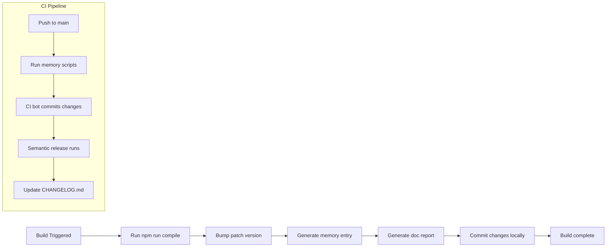
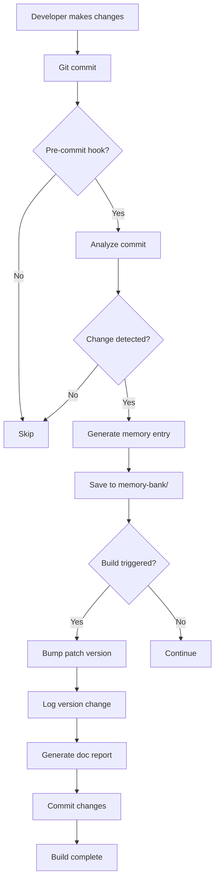

# Comprehensive Implementation Plan

## Project Overview

This plan implements a Kilocode Memory System for the Synthetic.ai Usage Tracker VS Code extension, along with project cleanup, documentation updates, and UI improvements.

## Confirmed Requirements

### Memory System Requirements
1. **Patch Version Logging**: Bump patch version in [`package.json`](package.json) on every build
2. **Memory Storage**: Use `memory-bank/` directory, tracked in git
3. **Documentation Updates**: Semi-automated (script generates report/checklist for humans to apply)
4. **Build Triggers**: Log on every local build AND in CI
5. **Integration**: CI bot commits changes automatically

### Project Cleanup & Enhancements
1. **VSIX Files**: Move existing VSIX files to `release/` folder
2. **Code Cleanup**: Remove unused/legacy code and unnecessary comments
3. **Documentation**: Update to remove references to unimplemented features
4. **License**: Change from MIT to GPL-3.0
5. **[`.gitignore`](.gitignore)**: Update with relevant entries

### UI Improvements
1. **Status Bar**: Minimize blinking/redraw on refresh
2. **Tooltip**: Add line breaks separating time remaining, quota, and reset time

### Referral System
1. **Referral Link**: https://synthetic.new/?referral=4JZcLOKgRmZ4o6k
2. **Documentation**: Add referral explanation and signup link
3. **Extension UI**: Add a clean button/command for referral signup

---

## File Structure

```
synthetic-usage-tracker/
├── .memory/                          # Memory system configuration
│   ├── config.json                   # Memory system settings
│   └── .gitkeep                      # Ensure directory is tracked
├── memory-bank/                      # Tracked memory entries (git)
│   ├── entries/                      # Individual memory entries (JSON)
│   │   ├── 2025-01-25-feature-auto-refresh (JSON file in memory-bank/entries/)
│   │   ├── 2025-01-26-fix-api-error (JSON file in memory-bank/entries/)
│   │   └── ...
│   ├── indices/                      # Index files for fast lookup
│   │   ├── by-type.json
│   │   ├── by-component.json
│   │   └── by-version.json
│   ├── MEMORY.md                     # Human-readable memory log (documented in [`agents.md`](agents.md))
│   └── VERSION_HISTORY.md            # Version change log (documented in [`agents.md`](agents.md))
├── release/                          # Release artifacts
│   └── .gitkeep                      # Ensure directory is tracked
├── scripts/
│   ├── memory/                      # Memory system scripts
│   │   ├── analyze-commits.ts       # Commit analysis script
│   │   ├── generate-entry.ts       # Memory entry generator
│   │   ├── generate-doc-report.ts   # Generate doc update report
│   │   ├── log-version.ts           # Version logging script
│   │   ├── bump-patch.ts            # Patch version bumper
│   │   ├── init-memory.ts           # Memory initialization
│   │   └── query-memory.ts          # Memory query utility
│   ├── hooks/                       # Git hooks
│   │   ├── pre-commit               # Pre-commit hook
│   │   └── post-build               # Post-build hook
│   └── utils/
│       ├── commit-parser.ts         # Commit message parser
│       ├── diff-analyzer.ts         # Code diff analyzer
│       └── version-utils.ts         # Version utility functions
├── src/
│   ├── referral/                     # NEW: Referral feature
│   │   └── referral.ts              # Referral link and command
│   ├── extension.ts                  # UPDATE: Add referral command
│   ├── config/
│   │   └── configuration.ts         # UPDATE: Add referral config
│   └── statusBar/
│       └── usageIndicator.ts         # UPDATE: Minimize redraw, improve tooltip
├── docs/
│   ├── api.md                        # UPDATE: Remove unimplemented features
│   ├── architecture.md               # UPDATE: Reflect current architecture
│   ├── development.md                # UPDATE: Update with new scripts
│   ├── installation.md               # UPDATE: GPL-3.0 license info
│   ├── README.md                     # UPDATE: Add referral section
│   └── troubleshooting.md            # UPDATE: Remove obsolete info
├── LICENSE                            # UPDATE: Change to GPL-3.0
├── package.json                      # UPDATE: Add memory scripts, referral command
├── .gitignore                        # UPDATE: Add release/, memory-bank indices
├── .vscodeignore                     # UPDATE: Add release/ to ignore
└── README.md                         # UPDATE: Add referral section
```

---

## Implementation Phases

### Phase 1: Project Cleanup & Preparation

**Tasks:**
1. Create `release/` directory and move existing `.vsix` files
2. Update [`.gitignore`](.gitignore) to include appropriate patterns
3. Update [`.vscodeignore`](.vscodeignore) to exclude `release/`
4. Change [`LICENSE`](LICENSE) from MIT to GPL-3.0
5. Audit and remove unused/legacy code from source files
6. Remove unnecessary comments
7. Review and clean up documentation files

**Files to Modify:**
- Create: `release/.gitkeep`
- Modify: [`.gitignore`](.gitignore)
- Modify: [`.vscodeignore`](.vscodeignore)
- Modify: [`LICENSE`](LICENSE)
- Modify: [`src/extension.ts`](src/extension.ts)
- Modify: [`src/api/syntheticService.ts`](src/api/syntheticService.ts)
- Modify: [`src/config/configuration.ts`](src/config/configuration.ts)
- Modify: [`src/statusBar/usageIndicator.ts`](src/statusBar/usageIndicator.ts)
- Modify: [`docs/api.md`](docs/api.md)
- Modify: [`docs/architecture.md`](docs/architecture.md)
- Modify: [`docs/development.md`](docs/development.md)
- Modify: [`docs/installation.md`](docs/installation.md)
- Modify: [`docs/troubleshooting.md`](docs/troubleshooting.md)

---

### Phase 2: Memory System Core Infrastructure

**Tasks:**
1. Create memory system directory structure
2. Define TypeScript interfaces for memory entries
3. Implement commit parser utility
4. Implement diff analyzer utility
5. Create memory initialization script

**Files to Create:**
- Create: `memory-bank/.gitkeep`
- Create: `memory-bank/entries/.gitkeep`
- Create: `memory-bank/indices/.gitkeep`
- Create: `memory-bank/MEMORY.md`
- Create: `memory-bank/VERSION_HISTORY.md`
- Create: `scripts/utils/commit-parser.ts`
- Create: `scripts/utils/diff-analyzer.ts`
- Create: `scripts/utils/version-utils.ts`
- Create: `scripts/memory/init-memory.ts`

**Files to Modify:**
- Modify: [`package.json`](package.json) - Add memory scripts

---

### Phase 3: Memory Entry Generation

**Tasks:**
1. Implement commit analyzer script
2. Implement memory entry generator script
3. Create memory entry validation
4. Implement memory database indexing

**Files to Create:**
- Create: `scripts/memory/analyze-commits.ts`
- Create: `scripts/memory/generate-entry.ts`
- Create: `scripts/memory/bump-patch.ts`
- Create: `scripts/memory/log-version.ts`

---

### Phase 4: Documentation Update Reports

**Tasks:**
1. Define documentation update rules
2. Implement documentation analyzer
3. Create doc update report generator
4. Generate checklist format for manual updates

**Files to Create:**
- Create: `scripts/memory/generate-doc-report.ts`

**Sample Report Format:**
```markdown
# Documentation Update Report
Generated: 2025-01-25T14:30:00Z

## Changes Detected

### Feature Added: Toggle Auto-Refresh
- **Files Changed**: src/extension.ts, src/statusBar/usageIndicator.ts
- **Commit**: feat(statusBar): add toggle auto-refresh command

## Recommended Documentation Updates

### README.md
- [ ] Add new command to Commands table
- [ ] Update Features section if applicable
- [ ] Add to Getting Started section

### docs/README.md
- [ ] Document new command in Commands section
- [ ] Update API references if needed

### docs/architecture.md
- [ ] Update architecture diagram if structure changed
- [ ] Document new component if added

## Manual Review Required
- [ ] Verify all references are accurate
- [ ] Check for obsolete documentation
- [ ] Update screenshots if applicable
```

---

### Phase 5: Git Hooks Integration

**Tasks:**
1. Create pre-commit hook
2. Create post-build hook
3. Configure Husky to use custom hooks
4. Test hook execution

**Files to Create:**
- Create: `scripts/hooks/pre-commit`
- Create: `scripts/hooks/post-build`

**Files to Modify:**
- Modify: [`package.json`](package.json) - Add hook scripts

---

### Phase 6: Build Integration

**Tasks:**
1. Update NPM scripts for memory system
2. Integrate patch version bumping in build
3. Configure CI to run memory scripts
4. Set up CI bot for automatic commits

**Files to Modify:**
- Modify: [`package.json`](package.json) - Add build scripts

**New NPM Scripts:**
```json
{
  "scripts": {
    "memory:init": "ts-node scripts/memory/init-memory.ts",
    "memory:analyze": "ts-node scripts/memory/analyze-commits.ts",
    "memory:generate": "ts-node scripts/memory/generate-entry.ts",
    "memory:doc-report": "ts-node scripts/memory/generate-doc-report.ts",
    "memory:log-version": "ts-node scripts/memory/log-version.ts",
    "memory:bump-patch": "ts-node scripts/memory/bump-patch.ts",
    "memory:query": "ts-node scripts/memory/query-memory.ts",
    "memory:update": "npm run memory:analyze && npm run memory:generate && npm run memory:log-version && npm run memory:doc-report",
    "build": "npm run compile && npm run memory:update",
    "compile": "tsc -p ./"
  }
}
```

---

### Phase 7: UI Improvements

**Tasks:**
1. Minimize status bar redraw on refresh
2. Add line breaks to tooltip for better formatting
3. Implement smooth status bar updates

**Files to Modify:**
- Modify: [`src/statusBar/usageIndicator.ts`](src/statusBar/usageIndicator.ts)

**Tooltip Format:**
```
Usage: 75% (750/1000 requests)

Time Remaining: 3h 45m

Reset: 2025-01-26 at 00:00 UTC
```

---

### Phase 8: Referral System

**Tasks:**
1. Create referral module
2. Add referral command to extension
3. Add referral configuration option
4. Create clean button/command in UI
5. Update documentation with referral info

**Files to Create:**
- Create: `src/referral/referral.ts`

**Files to Modify:**
- Modify: [`src/extension.ts`](src/extension.ts)
- Modify: [`package.json`](package.json) - Add referral command
- Modify: [`docs/README.md`](docs/README.md)
- Modify: [`README.md`](README.md)

**Referral Button Text:** "Get Free Credits"

**Command:** `syntheticUsageTracker.getFreeCredits`

---

### Phase 9: Documentation Updates (Manual)

**Tasks:**
1. Update [`README.md`](README.md) with referral section
2. Update all docs to reflect GPL-3.0 license
3. Remove references to unimplemented features
4. Ensure all docs are current and relevant

**Files to Modify:**
- Modify: [`README.md`](README.md)
- Modify: [`docs/api.md`](docs/api.md)
- Modify: [`docs/architecture.md`](docs/architecture.md)
- Modify: [`docs/development.md`](docs/development.md)
- Modify: [`docs/installation.md`](docs/installation.md)
- Modify: [`docs/README.md`](docs/README.md)
- Modify: [`docs/troubleshooting.md`](docs/troubleshooting.md)

---

### Phase 10: CI Configuration

**Tasks:**
1. Configure CI workflow to run memory scripts
2. Set up CI bot credentials for automatic commits
3. Configure CI to commit memory updates
4. Test CI pipeline end-to-end

**Files to Create:**
- Create: `.github/workflows/memory-update.yml`

**CI Workflow:**
```yaml
name: Memory Update

on:
  push:
    branches: [main]

jobs:
  memory-update:
    runs-on: ubuntu-latest
    permissions:
      contents: write
    steps:
      - uses: actions/checkout@v4
        with:
          token: ${{ secrets.GITHUB_TOKEN }}
      - uses: actions/setup-node@v4
        with:
          node-version: '20'
      - run: npm ci
      - run: npm run memory:update
      - name: Commit changes
        run: |
          git config --local user.email "ci-bot@example.com"
          git config --local user.name "CI Bot"
          git add .
          git diff --quiet && git diff --staged --quiet || git commit -m "ci: auto-update memory and documentation"
          git push
```

---

## Memory Entry Schema

```typescript
interface MemoryEntry {
  // Metadata
  id: string;                    // Unique ID (timestamp + hash)
  timestamp: ISO8601String;      // Entry timestamp
  entryType: EntryType;         // Type of entry
  
  // Version information
  version?: {
    previous: string;            // Previous version (e.g., "1.0.0")
    current: string;             // Current version (e.g., "1.0.1")
    incrementType: 'major' | 'minor' | 'patch';
    reason: string;             // Reason for version change
  };
  
  // Change information
  change: {
    type: ChangeType;           // feat, fix, docs, etc.
    scope?: string;             // Component/module affected
    subject: string;            // Brief description
    description?: string;      // Detailed description
    breakingChange?: boolean;   // Whether this is a breaking change
  };
  
  // Code changes
  files: {
    added: string[];            // Added files
    modified: string[];        // Modified files
    deleted: string[];         // Deleted files
  };
  
  // Documentation impact
  docsImpact: {
    requiresUpdate: boolean;    // Whether docs need updating
    affectedDocs: string[];     // Which docs to update
    updateType: UpdateType;     // Type of doc update needed
  };
  
  // Commit information
  commit: {
    hash: string;               // Git commit hash
    author: string;             // Commit author
    message: string;            // Full commit message
    branch: string;             // Branch name
  };
  
  // Related entries
  related?: string[];           // IDs of related entries
  
  // Tags for categorization
  tags: string[];               // Custom tags (e.g., [security, performance])
  
  // Notes
  notes?: string;               // Additional context or notes
}

type EntryType = 'feature' | 'fix' | 'refactor' | 'docs' | 'test' | 'build' | 'chore' | 'version' | 'decision';

type ChangeType = 'feat' | 'fix' | 'docs' | 'style' | 'refactor' | 'perf' | 'test' | 'build' | 'ci' | 'chore' | 'revert';

type UpdateType = 'none' | 'minor' | 'major' | 'new-section' | 'full-rewrite';
```

---

## Build Process Flow



---

## Memory System Workflow



---

## Referral Integration

### Command Registration

```typescript
// In extension.ts
context.subscriptions.push(
  vscode.commands.registerCommand(
    'syntheticUsageTracker.getFreeCredits',
    async () => {
      const referralUrl = 'https://synthetic.new/?referral=4JZcLOKgRmZ4o6k';
      const result = await vscode.window.showInformationMessage(
        'Get Free Credits for Synthetic.ai',
        'Open Signup Page',
        'Learn More'
      );
      
      if (result === 'Open Signup Page') {
        vscode.env.openExternal(vscode.Uri.parse(referralUrl));
      }
    }
  )
);
```

### Documentation Section

```markdown
## Get Free Credits

Share Synthetic.ai with your friends and both of you will receive subscription credits:

- **$10.00** for standard signups
- **$20.00** for pro signups

[Get your referral link](https://synthetic.new/?referral=4JZcLOKgRmZ4o6k)
```

---

## Configuration

### .memory/config.json

```json
{
  "enabled": true,
  "storagePath": "memory-bank",
  "entryFormat": "json",
  "autoBumpPatch": true,
  "generateDocReport": true,
  "hooks": {
    "preCommit": true,
    "postBuild": true
  },
  "indexing": {
    "enabled": true,
    "indices": ["by-type", "by-component", "by-version", "by-date"]
  }
}
```

---

## Testing Checklist

### Phase 1: Cleanup
- [ ] VSIX files moved to `release/`
- [ ] [`.gitignore`](.gitignore) updated correctly
- [ ] License changed to GPL-3.0
- [ ] Unused code removed
- [ ] Documentation cleaned up

### Phase 2-6: Memory System
- [ ] Memory directories created and tracked
- [ ] Init script runs successfully
- [ ] Commit analyzer works correctly
- [ ] Memory entry generator produces valid JSON
- [ ] Patch version bumps correctly
- [ ] Version logging works
- [ ] Doc report generates correctly
- [ ] Git hooks execute properly
- [ ] Build integration works
- [ ] CI pipeline runs successfully

### Phase 7: UI Improvements
- [ ] Status bar redraw minimized
- [ ] Tooltip formatted with line breaks
- [ ] Smooth updates on refresh

### Phase 8: Referral System
- [ ] Referral command registered
- [ ] "Get Free Credits" button works
- [ ] Referral link opens in browser
- [ ] Documentation updated

### Phase 9-10: Documentation & CI
- [ ] All docs updated with GPL-3.0
- [ ] Unimplemented features removed from docs
- [ ] CI workflow configured
- [ ] CI bot commits successfully

---

## Benefits

1. **Complete Project History**: Every decision, feature, and bug fix is documented in `memory-bank/`
2. **Automated Version Tracking**: Patch versions bump on every build
3. **Documentation Reports**: Semi-automated reports guide manual doc updates
4. **Clean Codebase**: Legacy and unused code removed
5. **Better UX**: Smoother status bar updates and cleaner tooltips
6. **Referral System**: Easy way for users to share and get credits
7. **CI Integration**: Automatic commits keep memory updated
8. **GPL-3.0 License**: Updated to desired license

---

## Next Steps for Implementation

Once this plan is approved, switch to **Code mode** to implement:

1. **Phase 1**: Project cleanup and preparation
2. **Phase 2**: Memory system core infrastructure
3. **Phase 3**: Memory entry generation
4. **Phase 4**: Documentation update reports
5. **Phase 5**: Git hooks integration
6. **Phase 6**: Build integration
7. **Phase 7**: UI improvements
8. **Phase 8**: Referral system
9. **Phase 9**: Documentation updates
10. **Phase 10**: CI configuration

Each phase will be tested and validated before proceeding to the next phase.
