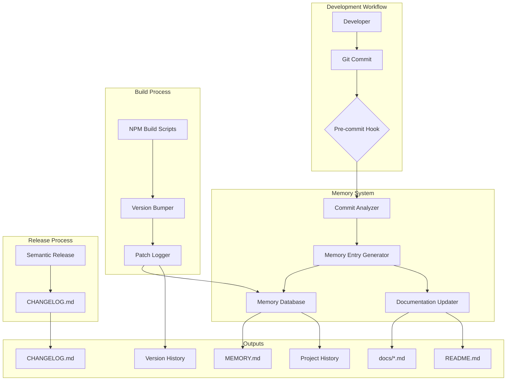
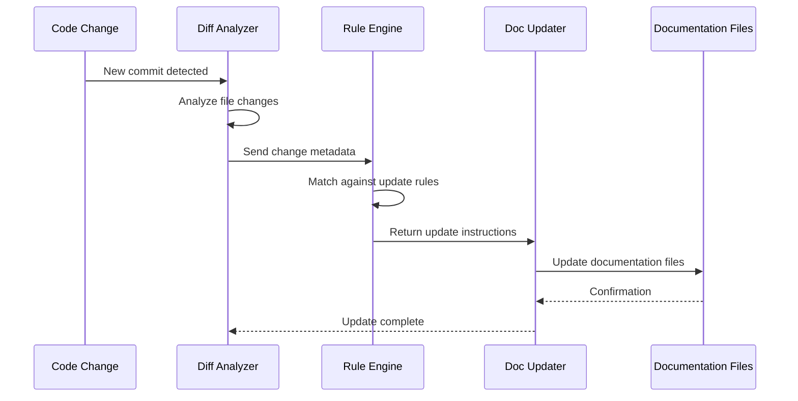
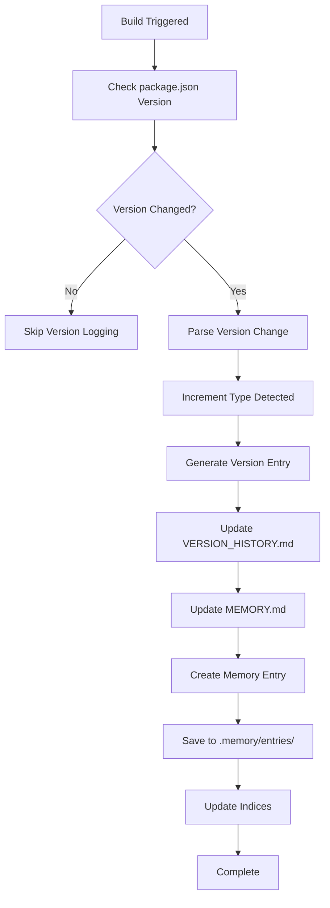
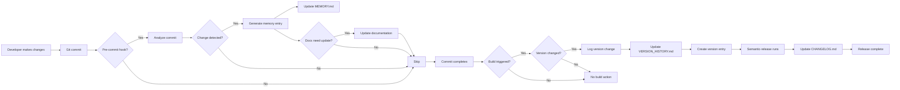
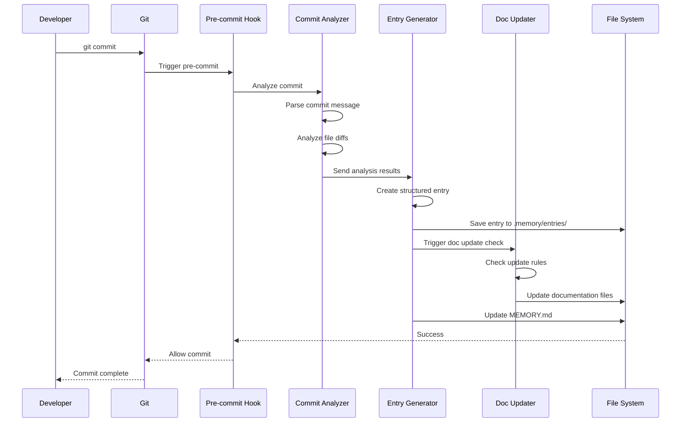

# Kilocode Memory System Design

## Executive Summary

This document outlines the architecture and design for an automated memory system that tracks project history, auto-updates documentation, manages changelog entries, and logs patch version increments during builds. The system uses a hybrid approach: leveraging semantic-release for CHANGELOG.md while implementing a custom memory system for comprehensive project history tracking.

## System Overview

The Kilocode Memory System (KMS) provides:

1. **Automated Memory Tracking**: Captures project decisions, features, bug fixes, and version changes
2. **Documentation Auto-Updates**: Keeps documentation synchronized with code changes
3. **Patch Version Logging**: Automatically logs version increments during builds
4. **Integration with Build Process**: Seamlessly hooks into existing NPM scripts and Git workflow

## Architecture

### System Components



### Component Responsibilities

| Component | Responsibility |
|-----------|---------------|
| **Commit Analyzer** | Parses commit messages, extracts metadata, categorizes changes |
| **Memory Entry Generator** | Creates structured memory entries from analyzed commits |
| **Memory Database** | Stores and retrieves project history entries |
| **Documentation Updater** | Updates documentation files based on code changes |
| **Version Bumper** | Handles semantic versioning and patch increments |
| **Patch Logger** | Records version changes with context |
| **Pre-commit Hook** | Triggers memory updates before commits |

## File Structure

```
synthetic-usage-tracker/
├── .memory/                          # Memory system directory
│   ├── config.json                   # Memory system configuration
│   ├── entries/                      # Individual memory entries (JSON)
│   │   ├── 2025-01-25-feature-auto-refresh.json
│   │   ├── 2025-01-26-fix-api-error.json
│   │   └── 2025-01-27-version-1.0.1.json
│   └── indices/                      # Index files for fast lookup
│       ├── by-type.json
│       ├── by-component.json
│       └── by-version.json
├── MEMORY.md                         # Human-readable memory log
├── VERSION_HISTORY.md                # Version change log
├── scripts/
│   ├── memory/                      # Memory system scripts
│   │   ├── analyze-commits.ts       # Commit analysis script
│   │   ├── generate-entry.ts       # Memory entry generator
│   │   ├── update-docs.ts           # Documentation updater
│   │   ├── log-version.ts           # Version logging script
│   │   ├── init-memory.ts           # Memory initialization
│   │   └── query-memory.ts          # Memory query utility
│   ├── hooks/                       # Git hooks
│   │   └── pre-commit               # Pre-commit hook trigger
│   └── utils/
│       ├── commit-parser.ts         # Commit message parser
│       ├── diff-analyzer.ts         # Code diff analyzer
│       └── doc-sync.ts              # Documentation synchronizer
├── package.json                     # Updated with memory scripts
└── .memoryrc                        # Memory system configuration
```

## Memory Entry Schema

### Entry Structure

Each memory entry is a JSON file with the following structure:

```typescript
interface MemoryEntry {
  // Metadata
  id: string;                    // Unique ID (timestamp + hash)
  timestamp: ISO8601String;      // Entry timestamp
  entryType: EntryType;         // Type of entry
  
  // Version information
  version?: {
    previous: string;            // Previous version (e.g., "1.0.0")
    current: string;             // Current version (e.g., "1.0.1")
    incrementType: 'major' | 'minor' | 'patch';
    reason: string;             // Reason for version change
  };
  
  // Change information
  change: {
    type: ChangeType;           // feat, fix, docs, etc.
    scope?: string;             // Component/module affected
    subject: string;            // Brief description
    description?: string;      // Detailed description
    breakingChange?: boolean;   // Whether this is a breaking change
  };
  
  // Code changes
  files: {
    added: string[];            // Added files
    modified: string[];        // Modified files
    deleted: string[];         // Deleted files
  };
  
  // Documentation impact
  docsImpact: {
    requiresUpdate: boolean;    // Whether docs need updating
    affectedDocs: string[];     // Which docs to update
    updateType: UpdateType;     // Type of doc update needed
  };
  
  // Commit information
  commit: {
    hash: string;               // Git commit hash
    author: string;             // Commit author
    message: string;            // Full commit message
    branch: string;             // Branch name
  };
  
  // Related entries
  related?: string[];           // IDs of related entries
  
  // Tags for categorization
  tags: string[];               // Custom tags (e.g., [security, performance])
  
  // Notes
  notes?: string;               // Additional context or notes
}

type EntryType = 'feature' | 'fix' | 'refactor' | 'docs' | 'test' | 'build' | 'chore' | 'version' | 'decision';

type ChangeType = 'feat' | 'fix' | 'docs' | 'style' | 'refactor' | 'perf' | 'test' | 'build' | 'ci' | 'chore' | 'revert';

type UpdateType = 'none' | 'minor' | 'major' | 'new-section' | 'full-rewrite';
```

### Example Memory Entry

```json
{
  "id": "20250125-143052-abc123",
  "timestamp": "2025-01-25T14:30:52.000Z",
  "entryType": "feature",
  "version": {
    "previous": "1.0.0",
    "current": "1.0.1",
    "incrementType": "patch",
    "reason": "Added auto-refresh toggle feature"
  },
  "change": {
    "type": "feat",
    "scope": "statusBar",
    "subject": "Add toggle auto-refresh command",
    "description": "Users can now enable/disable auto-refresh from command palette. This was requested by users who wanted to reduce API calls during development.",
    "breakingChange": false
  },
  "files": {
    "added": [],
    "modified": ["src/extension.ts", "src/statusBar/usageIndicator.ts"],
    "deleted": []
  },
  "docsImpact": {
    "requiresUpdate": true,
    "affectedDocs": ["docs/README.md", "README.md"],
    "updateType": "minor"
  },
  "commit": {
    "hash": "abc123def456",
    "author": "John Doe <john@example.com>",
    "message": "feat(statusBar): add toggle auto-refresh command\n\nUsers can now enable/disable auto-refresh from command palette",
    "branch": "main"
  },
  "related": [],
  "tags": ["user-request", "api-usage", "enhancement"],
  "notes": "This feature was requested in issue #42"
}
```

## MEMORY.md Format

The MEMORY.md file (documented in [`agents.md`](agents.md)) provides a human-readable, chronological log of all memory entries:

```markdown
# Project Memory

This file contains a chronological history of project decisions, features, bug fixes, and version changes.

## 2025-01-25

### 14:30 - Feature: Add Toggle Auto-Refresh Command
**Version**: 1.0.1 (patch)

Added a new command that allows users to enable/disable auto-refresh from the command palette.

**Affected Components**: statusBar

**Files Changed**:
- Modified: [`src/extension.ts`](src/extension.ts)
- Modified: [`src/statusBar/usageIndicator.ts`](src/statusBar/usageIndicator.ts)

**Documentation Impact**: Minor updates to [`README.md`](README.md) and [`docs/README.md`](docs/README.md)

**Rationale**: This feature was requested by users who wanted to reduce API calls during development.

**Tags**: user-request, api-usage, enhancement

**Related Issues**: #42

---

### 09:15 - Decision: Adopt Conventional Commits
**Version**: 1.0.0

Decided to adopt conventional commits with commitlint enforcement for consistent commit messages.

**Rationale**: Improves readability, enables automated changelog generation, and helps track changes.

**Tags**: process, workflow, standards

---

## 2025-01-24

### 16:45 - Fix: API Error Handling
**Version**: 0.9.9 (patch)

Fixed exponential backoff retry logic to properly handle rate limit errors.

**Affected Components**: api/syntheticService

**Files Changed**:
- Modified: [`src/api/syntheticService.ts`](src/api/syntheticService.ts)

**Bug**: Retry mechanism was not respecting the maximum delay, causing excessive API calls.

**Tags**: bugfix, api, error-handling
```

## VERSION_HISTORY.md Format

The VERSION_HISTORY.md file (documented in [`agents.md`](agents.md)) tracks all version changes with detailed context:

```markdown
# Version History

Complete history of version changes with context and rationale.

## Version 1.0.1 - 2025-01-25

**Increment Type**: Patch
**Previous Version**: 1.0.0

**Reason**: Added toggle auto-refresh feature

**Changes**:
- feat(statusBar): add toggle auto-refresh command

**Breaking Changes**: None

**Memory Entry**: 20250125-143052-abc123 (JSON file in .memory/entries/)

---

## Version 1.0.0 - 2025-01-20

**Increment Type**: Minor
**Previous Version**: 0.9.0

**Reason**: Initial stable release with core functionality

**Changes**:
- Complete implementation of usage monitoring
- Secure API key storage
- Configurable thresholds
- Status bar integration

**Breaking Changes**: None

**Memory Entry**: 20250120-100000-initial-release (JSON file in .memory/entries/)
```

## Integration with Build Process

### NPM Scripts

Add the following scripts to [`package.json`](package.json):

```json
{
  "scripts": {
    "memory:init": "ts-node scripts/memory/init-memory.ts",
    "memory:analyze": "ts-node scripts/memory/analyze-commits.ts",
    "memory:update": "ts-node scripts/memory/generate-entry.ts && ts-node scripts/memory/update-docs.ts",
    "memory:query": "ts-node scripts/memory/query-memory.ts",
    "version:bump": "ts-node scripts/memory/log-version.ts",
    "pre-commit": "ts-node scripts/hooks/pre-commit",
    "build": "npm run compile && npm run memory:update",
    "release": "semantic-release"
  }
}
```

### Git Hooks

#### Pre-commit Hook

```bash
#!/bin/bash
# scripts/hooks/pre-commit

# Run memory update on commit
npm run memory:analyze --last-commit HEAD

# Exit if memory update failed
if [ $? -ne 0 ]; then
  echo "❌ Memory update failed. Commit aborted."
  exit 1
fi

echo "✅ Memory updated successfully"
```

### Husky Integration

```json
{
  "husky": {
    "hooks": {
      "pre-commit": "npm run pre-commit",
      "post-commit": "npm run memory:update",
      "pre-release": "npm run version:bump"
    }
  }
}
```

## Automated Documentation Update Mechanism

### Documentation Synchronization

The documentation updater analyzes code changes and determines which documentation files need updates:

1. **API Changes** → Updates [`docs/api.md`](docs/api.md)
2. **Configuration Changes** → Updates [`docs/README.md`](docs/README.md) and [`README.md`](README.md)
3. **Architecture Changes** → Updates [`docs/architecture.md`](docs/architecture.md)
4. **Development Changes** → Updates [`docs/development.md`](docs/development.md)
5. **New Features** → Updates feature sections in relevant docs
6. **Bug Fixes** → Updates [`docs/troubleshooting.md`](docs/troubleshooting.md)

### Update Rules

```typescript
interface DocUpdateRule {
  trigger: {
    filePattern: string[];      // File patterns to match
    changeType: ChangeType[];   // Change types to match
    scope?: string[];           // Specific scopes
  };
  target: string;               // Documentation file to update
  updateType: UpdateType;       // Type of update needed
  section?: string;             // Specific section to update
}

const docUpdateRules: DocUpdateRule[] = [
  {
    trigger: {
      filePattern: ['src/api/*.ts'],
      changeType: ['feat', 'fix'],
      scope: ['api']
    },
    target: 'docs/api.md',
    updateType: 'minor',
    section: 'API Endpoints'
  },
  {
    trigger: {
      filePattern: ['package.json'],
      changeType: ['feat'],
      scope: ['config']
    },
    target: 'docs/README.md',
    updateType: 'minor',
    section: 'Configuration'
  },
  {
    trigger: {
      filePattern: ['src/**/*.ts'],
      changeType: ['feat'],
      scope: ['statusBar', 'commands']
    },
    target: 'README.md',
    updateType: 'minor',
    section: 'Features'
  }
];
```

### Documentation Update Workflow



## Patch Version Logging System

### Version Detection and Logging

The patch version logging system automatically detects version changes and logs them:



### Version Change Detection

```typescript
// scripts/memory/log-version.ts

interface VersionChange {
  previous: string;
  current: string;
  incrementType: 'major' | 'minor' | 'patch';
  timestamp: string;
  trigger: 'manual' | 'semantic-release' | 'script';
  reason: string;
}

async function detectVersionChange(): Promise<VersionChange | null> {
  const previous = await getLastGitTagVersion();
  const current = getCurrentPackageVersion();
  
  if (!previous || previous === current) {
    return null;
  }
  
  const prevParts = previous.split('.').map(Number);
  const currParts = current.split('.').map(Number);
  
  let incrementType: 'major' | 'minor' | 'patch';
  
  if (currParts[0] > prevParts[0]) {
    incrementType = 'major';
  } else if (currParts[1] > prevParts[1]) {
    incrementType = 'minor';
  } else if (currParts[2] > prevParts[2]) {
    incrementType = 'patch';
  }
  
  return {
    previous,
    current,
    incrementType,
    timestamp: new Date().toISOString(),
    trigger: 'build',
    reason: determineChangeReason(previous, current, incrementType)
  };
}
```

### Integration with Semantic-Release

The memory system works alongside semantic-release:

- **Semantic-Release**: Handles [`CHANGELOG.md`](CHANGELOG.md) and publishes releases
- **Memory System**: Tracks detailed project history in [`MEMORY.md`](MEMORY.md) and [`VERSION_HISTORY.md`](VERSION_HISTORY.md)

Both systems trigger on version changes but serve different purposes:

| Aspect | Semantic-Release | Memory System |
|--------|------------------|---------------|
| Primary Output | CHANGELOG.md | MEMORY.md, VERSION_HISTORY.md |
| Focus | Release notes | Complete project history |
| Version Detection | Automatic via commits | Manual + automatic |
| Granularity | Release-level | Commit-level + release-level |
| Audience | End users | Developers |

## Memory Query System

### Query Interface

Provide a CLI for querying the memory database:

```bash
# Query by type
npm run memory:query -- --type feature

# Query by date range
npm run memory:query -- --from 2025-01-01 --to 2025-01-31

# Query by tag
npm run memory:query -- --tag security

# Query by component
npm run memory:query -- --component api

# Query by version
npm run memory:query -- --version 1.0.1

# Show full entry
npm run memory:query -- --id 20250125-143052-abc123
```

### Query Output Formats

```bash
# JSON output (default)
npm run memory:query -- --json

# Markdown output
npm run memory:query -- --format markdown

# Table output
npm run memory:query -- --format table

# Verbose output
npm run memory:query -- --verbose
```

## Configuration

### .memoryrc Configuration File

```json
{
  "memory": {
    "enabled": true,
    "autoUpdate": true,
    "storagePath": ".memory",
    "entryFormat": "json"
  },
  "documentation": {
    "autoUpdate": true,
    "updateOnCommit": true,
    "updateOnBuild": true,
    "docsToUpdate": [
      "README.md",
      "docs/README.md",
      "docs/api.md",
      "docs/architecture.md"
    ]
  },
  "versioning": {
    "autoLog": true,
    "logPatches": true,
    "logAllChanges": true,
    "versionFile": "VERSION_HISTORY.md"
  },
  "hooks": {
    "preCommit": true,
    "postCommit": true,
    "preRelease": true
  },
  "indexing": {
    "enabled": true,
    "indices": ["by-type", "by-component", "by-version", "by-date"]
  }
}
```

## Memory System Workflow

### Complete Workflow Diagram



### Memory Entry Creation Process



## Implementation Roadmap

### Phase 1: Core Memory System

- [ ] Create memory entry schema and TypeScript interfaces
- [ ] Implement commit analyzer
- [ ] Implement memory entry generator
- [ ] Create `.memory/` directory structure
- [ ] Build memory database with indexing

### Phase 2: Documentation Updates

- [ ] Implement diff analyzer
- [ ] Create documentation update rules
- [ ] Build documentation updater
- [ ] Test documentation synchronization

### Phase 3: Version Logging

- [ ] Implement version change detection
- [ ] Create version logging script
- [ ] Build VERSION_HISTORY.md generator
- [ ] Integrate with semantic-release

### Phase 4: Build Integration

- [ ] Add NPM scripts
- [ ] Implement pre-commit hook
- [ ] Configure Husky hooks
- [ ] Test build process integration

### Phase 5: Query System

- [ ] Implement memory query CLI
- [ ] Create query filters and parsers
- [ ] Build output formatters (JSON, Markdown, Table)
- [ ] Add search capabilities

### Phase 6: Configuration and Polish

- [ ] Create `.memoryrc` configuration
- [ ] Add configuration validation
- [ ] Create initialization script
- [ ] Write comprehensive documentation
- [ ] Add error handling and logging

## Benefits

1. **Comprehensive Project History**: Every decision, feature, and bug fix is documented
2. **Automated Documentation**: Documentation stays in sync with code changes
3. **Version Context**: Complete history of why versions changed
4. **Developer Productivity**: Less manual documentation work
5. **Onboarding**: New developers can quickly understand project history
6. **Decision Tracking**: Clear record of architectural and technical decisions
7. **Maintainability**: Easy to track the evolution of the codebase

## Next Steps

Once this architecture is approved, the implementation will proceed in Code mode with the following sequence:

1. Implement Phase 1: Core Memory System
2. Implement Phase 2: Documentation Updates
3. Implement Phase 3: Version Logging
4. Implement Phase 4: Build Integration
5. Implement Phase 5: Query System
6. Implement Phase 6: Configuration and Polish

Each phase will be tested and validated before proceeding to the next phase.
