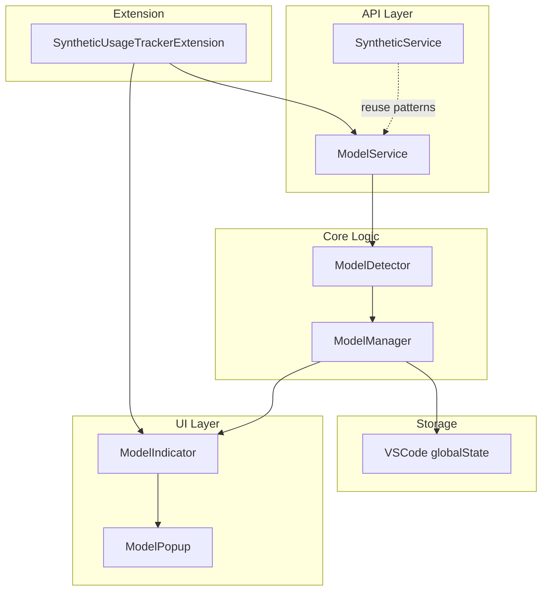

# Model Tracking Implementation Plan

## Overview

This document provides a comprehensive implementation plan for adding model tracking capabilities to the Synthetic Usage Tracker VSCode extension. The feature will monitor the Synthetic.new API for changes to available models, detect additions/removals, pricing changes, and feature updates, and notify users through the status bar and popup UI.

## API Structure Analysis

### Endpoint

```
GET https://api.synthetic.new/v1/models
```

**Note:** The models endpoint uses v1, not v2 (which is used for quotas).

### Response Structure

```typescript
interface ModelsResponse {
  data: Model[];
}
```

### Model Interface

Based on the actual API response, each model has the following structure:

```typescript
interface Model {
  // Provider information
  provider: "synthetic" | "fireworks" | "together";
  always_on: boolean;

  // Model identification
  id: string;                    // Format: "hf:{hugging_face_id}"
  hugging_face_id: string;       // e.g., "zai-org/GLM-4.7"
  name: string;                  // Display name, same as hugging_face_id

  // Capabilities
  input_modalities: ["text"] | ["text", "image"];
  output_modalities: ["text"];

  // Context and output limits
  context_length: number;
  max_output_length: number;

  // Pricing structure (all values are strings like "$0.00000055" or "0")
  pricing: {
    prompt: string;              // Cost per prompt token
    completion: string;          // Cost per completion token
    image: string;               // Image processing cost
    request: string;             // Per-request cost
    input_cache_reads: string;   // Cache read cost
    input_cache_writes: string;  // Cache write cost
  };

  // Metadata
  created: number;               // Unix timestamp
  quantization: "fp8" | "int4";

  // Supported features (only present for some providers)
  supported_sampling_parameters?: string[];  // e.g., ["temperature", "top_k", ...]
  supported_features?: string[];             // e.g., ["tools", "json_mode", "structured_outputs", "reasoning"]

  // OpenRouter integration
  openrouter?: {
    slug: string;                // e.g., "z-ai/glm-4.7"
  };

  // Datacenter locations
  datacenters?: Array<{
    country_code: string;        // e.g., "US"
  }>;
}
```

### Key Observations

1. **Provider Variations**: Models from different providers have varying fields:
   - `synthetic` provider models include `supported_sampling_parameters`, `supported_features`, `openrouter`, and `datacenters`
   - `fireworks` and `together` provider models have fewer fields (missing the above optional fields)

2. **Pricing Format**: All pricing values are strings, some prefixed with "$", others just "0"

3. **Model ID Format**: All model IDs follow the pattern `hf:{hugging_face_id}`

4. **Optional Fields**: `supported_sampling_parameters`, `supported_features`, `openrouter`, and `datacenters` are not present on all models

## TypeScript Interfaces

```typescript
// src/api/modelService.ts

/**
 * Provider types for Synthetic.new models
 * Design decision: Using string type with known values for autocomplete,
 * but allowing any string to handle unexpected providers from the API.
 * This ensures forward compatibility when new providers are added.
 */
export type ModelProvider = "synthetic" | "fireworks" | "together" | (string & {});

/**
 * Quantization types supported
 * Design decision: Flexible type to accommodate new quantization methods
 * that may be added in the future without requiring code changes.
 */
export type QuantizationType = "fp8" | "int4" | (string & {});

/**
 * Model pricing structure
 * Note: All values are strings, some with "$" prefix
 */
export interface ModelPricing {
  prompt: string;
  completion: string;
  image: string;
  request: string;
  input_cache_reads: string;
  input_cache_writes: string;
}

/**
 * Datacenter location information
 */
export interface Datacenter {
  country_code: string;
}

/**
 * OpenRouter integration metadata
 */
export interface OpenRouterInfo {
  slug: string;
}

/**
 * Complete model information from API
 * Design decision: Using index signature to allow for additional fields
 * that may be added to the API response in the future. This ensures
 * forward compatibility and prevents type errors when new fields are introduced.
 */
export interface Model {
  provider: ModelProvider;
  always_on: boolean;
  id: string;
  hugging_face_id: string;
  name: string;
  input_modalities: string[];
  output_modalities: string[];
  context_length: number;
  max_output_length: number;
  pricing: ModelPricing;
  created: number;
  quantization: QuantizationType;
  supported_sampling_parameters?: string[];
  supported_features?: string[];
  openrouter?: OpenRouterInfo;
  datacenters?: Datacenter[];
  /** Allow additional fields for forward compatibility */
  [key: string]: unknown;
}

/**
 * API response structure for models endpoint
 */
export interface ModelsResponse {
  data: Model[];
}

/**
 * Types of changes that can be detected
 */
export enum ModelChangeType {
  Added = "added",
  Removed = "removed",
  PricingChanged = "pricing_changed",
  FeaturesChanged = "features_changed",
  ProviderChanged = "provider_changed",
  AlwaysOnChanged = "always_on_changed",
  ContextLengthChanged = "context_length_changed",
  QuantizationChanged = "quantization_changed",
}

/**
 * Represents a detected change to a model
 */
export interface ModelChange {
  type: ModelChangeType;
  modelId: string;
  modelName: string;
  timestamp: number;
  details: {
    oldValue?: unknown;
    newValue?: unknown;
    differences?: string[];
  };
}

/**
 * Complete model snapshot for storage
 */
export interface ModelSnapshot {
  models: Model[];
  timestamp: number;
  checksum: string;  // For quick comparison
}

/**
 * Stored model history
 */
export interface ModelHistory {
  snapshots: ModelSnapshot[];
  changes: ModelChange[];
  lastChecked: number;
}
```

## Architecture



## Change Detection System

### Detection Logic

```typescript
// src/models/modelDetector.ts

/**
 * Detects changes between two model snapshots
 *
 * Design decision: Compare by model ID (hf:{hugging_face_id}) as the primary key.
 * This is more stable than using the hugging_face_id alone since the ID format
 * includes the provider prefix.
 */
export class ModelDetector {
  /**
   * Compare two model arrays and return detected changes
   */
  detectChanges(oldModels: Model[], newModels: Model[]): ModelChange[] {
    const changes: ModelChange[] = [];
    const oldMap = this.createModelMap(oldModels);
    const newMap = this.createModelMap(newModels);

    // Detect added models
    for (const [id, model] of newMap) {
      if (!oldMap.has(id)) {
        changes.push(this.createChange(ModelChangeType.Added, model));
      }
    }

    // Detect removed models
    for (const [id, model] of oldMap) {
      if (!newMap.has(id)) {
        changes.push(this.createChange(ModelChangeType.Removed, model));
      }
    }

    // Detect changes in existing models
    for (const [id, newModel] of newMap) {
      const oldModel = oldMap.get(id);
      if (oldModel) {
        const modelChanges = this.detectModelChanges(oldModel, newModel);
        changes.push(...modelChanges);
      }
    }

    return changes;
  }

  /**
   * Detect changes within a single model
   */
  private detectModelChanges(oldModel: Model, newModel: Model): ModelChange[] {
    const changes: ModelChange[] = [];

    // Check pricing changes
    if (this.hasPricingChanged(oldModel.pricing, newModel.pricing)) {
      changes.push(this.createChange(ModelChangeType.PricingChanged, newModel, {
        oldValue: oldModel.pricing,
        newValue: newModel.pricing,
      }));
    }

    // Check feature changes
    if (this.hasFeaturesChanged(oldModel, newModel)) {
      changes.push(this.createChange(ModelChangeType.FeaturesChanged, newModel, {
        oldValue: {
          supported_features: oldModel.supported_features,
          supported_sampling_parameters: oldModel.supported_sampling_parameters,
        },
        newValue: {
          supported_features: newModel.supported_features,
          supported_sampling_parameters: newModel.supported_sampling_parameters,
        },
      }));
    }

    // Check provider changes (rare but possible)
    if (oldModel.provider !== newModel.provider) {
      changes.push(this.createChange(ModelChangeType.ProviderChanged, newModel, {
        oldValue: oldModel.provider,
        newValue: newModel.provider,
      }));
    }

    // Check always_on changes
    if (oldModel.always_on !== newModel.always_on) {
      changes.push(this.createChange(ModelChangeType.AlwaysOnChanged, newModel, {
        oldValue: oldModel.always_on,
        newValue: newModel.always_on,
      }));
    }

    // Check context length changes
    if (oldModel.context_length !== newModel.context_length) {
      changes.push(this.createChange(ModelChangeType.ContextLengthChanged, newModel, {
        oldValue: oldModel.context_length,
        newValue: newModel.context_length,
      }));
    }

    return changes;
  }

  private createModelMap(models: Model[]): Map<string, Model> {
    return new Map(models.map(m => [m.id, m]));
  }

  private hasPricingChanged(old: ModelPricing, new_: ModelPricing): boolean {
    return old.prompt !== new_.prompt ||
           old.completion !== new_.completion ||
           old.image !== new_.image ||
           old.request !== new_.request ||
           old.input_cache_reads !== new_.input_cache_reads ||
           old.input_cache_writes !== new_.input_cache_writes;
  }

  private hasFeaturesChanged(old: Model, new_: Model): boolean {
    return !this.arraysEqual(old.supported_features, new_.supported_features) ||
           !this.arraysEqual(old.supported_sampling_parameters, new_.supported_sampling_parameters);
  }

  private arraysEqual(a: string[] | undefined, b: string[] | undefined): boolean {
    if (a === b) return true;
    if (!a || !b) return false;
    if (a.length !== b.length) return false;
    return a.every((val, i) => val === b[i]);
  }
}
```

## Status Bar Indicator

### Model Indicator Class

```typescript
// src/statusBar/modelIndicator.ts

/**
 * Status bar indicator for model changes
 *
 * Design decision: Separate indicator from usage indicator to allow independent
 * display and management. This follows the single responsibility principle and
 * allows users to have different refresh intervals for usage vs model tracking.
 */
export class ModelIndicator {
  private statusBarItem: vscode.StatusBarItem;
  private hasUnreadChanges: boolean = false;
  private changeCount: number = 0;
  private lastText: string | null = null;

  constructor(context: vscode.ExtensionContext) {
    this.statusBarItem = vscode.window.createStatusBarItem(
      vscode.StatusBarAlignment.Right,
      95,  // Slightly lower priority than usage indicator (100)
    );
    context.subscriptions.push(this.statusBarItem);

    this.setIdle();
    this.statusBarItem.show();
  }

  /**
   * Update indicator to show changes detected
   * Design decision: Using bold orange "!" marker for high visibility.
   * The warning background color provides orange highlighting, and the
   * bold exclamation mark draws attention to unread changes.
   */
  showChanges(count: number): void {
    this.hasUnreadChanges = true;
    this.changeCount = count;

    const text = `**$(alert) !** ${count} model change${count > 1 ? 's' : ''}`;
    const tooltip = this.buildChangesTooltip();

    if (this.lastText !== text) {
      this.statusBarItem.text = text;
      this.statusBarItem.tooltip = tooltip;
      this.statusBarItem.backgroundColor = new vscode.ThemeColor("statusBarItem.warningBackground");
      this.statusBarItem.command = "syntheticUsageTracker.showModelChanges";
      this.lastText = text;
    }
  }

  /**
   * Mark changes as read (user viewed them)
   */
  markAsRead(): void {
    this.hasUnreadChanges = false;
    this.setIdle();
  }

  /**
   * Set idle state - no changes or all viewed
   */
  setIdle(): void {
    const text = "$(server) Models";
    if (this.lastText !== text) {
      this.statusBarItem.text = text;
      this.statusBarItem.tooltip = "Click to view available models";
      this.statusBarItem.backgroundColor = undefined;
      this.statusBarItem.command = "syntheticUsageTracker.showModels";
      this.lastText = text;
    }
  }

  /**
   * Set loading state during fetch
   */
  setLoading(): void {
    const text = "$(loading~spin) Loading models...";
    this.statusBarItem.text = text;
    this.statusBarItem.tooltip = "Fetching model information...";
    this.statusBarItem.backgroundColor = undefined;
    this.lastText = null;  // Force update after loading
  }

  /**
   * Set error state
   */
  setError(message: string): void {
    const text = "$(error) Models";
    this.statusBarItem.text = text;
    this.statusBarItem.tooltip = message;
    this.statusBarItem.backgroundColor = new vscode.ThemeColor("statusBarItem.errorBackground");
    this.lastText = null;
  }

  private buildChangesTooltip(): string {
    const lines = [
      `${this.changeCount} model change${this.changeCount > 1 ? 's' : ''} detected`,
      "",
      "Click to view details",
    ];
    return lines.join("\n");
  }

  dispose(): void {
    this.statusBarItem.dispose();
  }
}
```

## Popup UI for Model Changes

### Webview Panel Design

```typescript
// src/ui/modelChangesPanel.ts

/**
 * Webview panel for displaying model changes
 *
 * Design decision: Use VSCode webview API for rich UI instead of simple
 * message boxes. This allows for better formatting, filtering, and history view.
 */
export class ModelChangesPanel {
  public static currentPanel: ModelChangesPanel | undefined;
  private readonly panel: vscode.WebviewPanel;
  private disposables: vscode.Disposable[] = [];

  private constructor(
    panel: vscode.WebviewPanel,
    private changes: ModelChange[],
    private history: ModelHistory,
  ) {
    this.panel = panel;
    this.panel.webview.html = this.getHtmlContent();
    this.setupMessageHandling();
  }

  /**
   * Show or create the panel
   */
  public static show(changes: ModelChange[], history: ModelHistory): void {
    if (ModelChangesPanel.currentPanel) {
      ModelChangesPanel.currentPanel.panel.reveal();
      ModelChangesPanel.currentPanel.update(changes, history);
    } else {
      const panel = vscode.window.createWebviewPanel(
        "modelChanges",
        "Synthetic.new Model Changes",
        vscode.ViewColumn.One,
        { enableScripts: true },
      );
      ModelChangesPanel.currentPanel = new ModelChangesPanel(panel, changes, history);
    }
  }

  /**
   * Generate HTML content for the webview
   */
  private getHtmlContent(): string {
    return `<!DOCTYPE html>
<html>
<head>
  <meta charset="UTF-8">
  <style>
    body {
      font-family: var(--vscode-font-family);
      padding: 20px;
      color: var(--vscode-foreground);
    }
    .header {
      margin-bottom: 20px;
      padding-bottom: 10px;
      border-bottom: 1px solid var(--vscode-panel-border);
    }
    .change-item {
      margin: 10px 0;
      padding: 15px;
      border-radius: 6px;
      background: var(--vscode-editor-background);
      border: 1px solid var(--vscode-panel-border);
    }
    .change-added { border-left: 4px solid #28a745; }
    .change-removed { border-left: 4px solid #dc3545; }
    .change-pricing { border-left: 4px solid #ffc107; }
    .change-features { border-left: 4px solid #17a2b8; }
    .model-name {
      font-weight: bold;
      font-size: 1.1em;
      margin-bottom: 5px;
    }
    .change-type {
      display: inline-block;
      padding: 2px 8px;
      border-radius: 3px;
      font-size: 0.85em;
      margin-right: 10px;
    }
    .badge-added { background: #28a745; color: white; }
    .badge-removed { background: #dc3545; color: white; }
    .badge-pricing { background: #ffc107; color: black; }
    .badge-features { background: #17a2b8; color: white; }
    .details {
      margin-top: 10px;
      font-size: 0.9em;
      color: var(--vscode-descriptionForeground);
    }
    .pricing-comparison {
      display: grid;
      grid-template-columns: 1fr 1fr;
      gap: 10px;
      margin-top: 10px;
    }
    .pricing-old { text-decoration: line-through; opacity: 0.6; }
    .pricing-new { color: #28a745; font-weight: bold; }
    .timestamp {
      font-size: 0.8em;
      color: var(--vscode-descriptionForeground);
      margin-top: 5px;
    }
    .filter-bar {
      margin-bottom: 20px;
      display: flex;
      gap: 10px;
    }
    .filter-btn {
      padding: 5px 15px;
      border: 1px solid var(--vscode-button-border);
      background: var(--vscode-button-background);
      color: var(--vscode-button-foreground);
      cursor: pointer;
      border-radius: 3px;
    }
    .filter-btn.active {
      background: var(--vscode-button-hoverBackground);
    }
    .stats {
      display: flex;
      gap: 20px;
      margin-bottom: 20px;
    }
    .stat-item {
      text-align: center;
    }
    .stat-value {
      font-size: 2em;
      font-weight: bold;
    }
    .stat-label {
      font-size: 0.9em;
      color: var(--vscode-descriptionForeground);
    }
  </style>
</head>
<body>
  <div class="header">
    <h1>Model Changes</h1>
    <p>Recent changes to available models on Synthetic.new</p>
  </div>

  <div class="stats">
    <div class="stat-item">
      <div class="stat-value" id="added-count">0</div>
      <div class="stat-label">Added</div>
    </div>
    <div class="stat-item">
      <div class="stat-value" id="removed-count">0</div>
      <div class="stat-label">Removed</div>
    </div>
    <div class="stat-item">
      <div class="stat-value" id="pricing-count">0</div>
      <div class="stat-label">Pricing</div>
    </div>
    <div class="stat-item">
      <div class="stat-value" id="features-count">0</div>
      <div class="stat-label">Features</div>
    </div>
  </div>

  <div class="filter-bar">
    <button class="filter-btn active" data-filter="all">All</button>
    <button class="filter-btn" data-filter="added">Added</button>
    <button class="filter-btn" data-filter="removed">Removed</button>
    <button class="filter-btn" data-filter="pricing">Pricing</button>
    <button class="filter-btn" data-filter="features">Features</button>
  </div>

  <div id="changes-list"></div>

  <script>
    // JavaScript for filtering and interaction
    const vscode = acquireVsCodeApi();

    document.querySelectorAll('.filter-btn').forEach(btn => {
      btn.addEventListener('click', () => {
        document.querySelectorAll('.filter-btn').forEach(b => b.classList.remove('active'));
        btn.classList.add('active');
        vscode.postMessage({ command: 'filter', type: btn.dataset.filter });
      });
    });
  </script>
</body>
</html>`;
  }

  private setupMessageHandling(): void {
    this.panel.webview.onDidReceiveMessage(
      message => {
        switch (message.command) {
          case 'filter':
            this.handleFilter(message.type);
            break;
          case 'viewModel':
            this.openModelDetails(message.modelId);
            break;
        }
      },
      null,
      this.disposables,
    );
  }

  private handleFilter(type: string): void {
    // Filter logic to update displayed changes
  }

  private openModelDetails(modelId: string): void {
    // Open model documentation or API reference
  }

  public update(changes: ModelChange[], history: ModelHistory): void {
    this.changes = changes;
    this.panel.webview.html = this.getHtmlContent();
  }

  public dispose(): void {
    ModelChangesPanel.currentPanel = undefined;
    this.panel.dispose();
    this.disposables.forEach(d => d.dispose());
  }
}
```

## Storage Strategy

### Model Storage Manager

```typescript
// src/storage/modelStorage.ts

/**
 * Storage keys for model data
 */
const STORAGE_KEYS = {
  MODEL_HISTORY: 'syntheticModelHistory',
  LAST_CHECKSUM: 'syntheticModelChecksum',
  LAST_CHECK: 'syntheticModelLastCheck',
} as const;

/**
 * Maximum number of snapshots to keep
 * Design decision: Limit storage to prevent excessive memory usage.
 * 30 snapshots at 6-hour intervals = ~7.5 days of history
 */
const MAX_SNAPSHOTS = 30;

/**
 * Maximum number of changes to keep
 */
const MAX_CHANGES = 100;

/**
 * Manages persistent storage of model data
 */
export class ModelStorage {
  constructor(private context: vscode.ExtensionContext) {}

  /**
   * Save a new model snapshot
   */
  async saveSnapshot(snapshot: ModelSnapshot): Promise<void> {
    const history = await this.getHistory();

    // Add new snapshot
    history.snapshots.push(snapshot);
    history.lastChecked = Date.now();

    // Trim old snapshots
    if (history.snapshots.length > MAX_SNAPSHOTS) {
      history.snapshots = history.snapshots.slice(-MAX_SNAPSHOTS);
    }

    await this.saveHistory(history);
    await this.context.globalState.update(STORAGE_KEYS.LAST_CHECKSUM, snapshot.checksum);
  }

  /**
   * Save detected changes
   */
  async saveChanges(changes: ModelChange[]): Promise<void> {
    const history = await this.getHistory();

    history.changes.push(...changes);

    // Trim old changes
    if (history.changes.length > MAX_CHANGES) {
      history.changes = history.changes.slice(-MAX_CHANGES);
    }

    await this.saveHistory(history);
  }

  /**
   * Get stored model history
   */
  async getHistory(): Promise<ModelHistory> {
    const stored = await this.context.globalState.get<ModelHistory>(STORAGE_KEYS.MODEL_HISTORY);
    return stored || {
      snapshots: [],
      changes: [],
      lastChecked: 0,
    };
  }

  /**
   * Get the most recent snapshot
   */
  async getLastSnapshot(): Promise<ModelSnapshot | undefined> {
    const history = await this.getHistory();
    return history.snapshots[history.snapshots.length - 1];
  }

  /**
   * Get stored checksum for quick comparison
   */
  async getLastChecksum(): Promise<string | undefined> {
    return this.context.globalState.get<string>(STORAGE_KEYS.LAST_CHECKSUM);
  }

  /**
   * Clear all stored model data
   */
  async clear(): Promise<void> {
    await this.context.globalState.update(STORAGE_KEYS.MODEL_HISTORY, undefined);
    await this.context.globalState.update(STORAGE_KEYS.LAST_CHECKSUM, undefined);
    await this.context.globalState.update(STORAGE_KEYS.LAST_CHECK, undefined);
  }

  private async saveHistory(history: ModelHistory): Promise<void> {
    await this.context.globalState.update(STORAGE_KEYS.MODEL_HISTORY, history);
  }
}
```

### Checksum Generation

```typescript
/**
 * Generate a simple checksum for quick comparison
 * Design decision: Use a hash of key model properties rather than
 * comparing entire arrays. This is faster and sufficient for detecting changes.
 */
export function generateChecksum(models: Model[]): string {
  const data = models
    .map(m => `${m.id}:${m.provider}:${m.pricing.prompt}:${m.pricing.completion}:${m.always_on}`)
    .sort()
    .join('|');

  // Simple hash function
  let hash = 0;
  for (let i = 0; i < data.length; i++) {
    const char = data.charCodeAt(i);
    hash = ((hash << 5) - hash) + char;
    hash = hash & hash;
  }
  return hash.toString(16);
}
```

## Implementation Phases

### Phase 1: Foundation

1. **Create ModelService** (`src/api/modelService.ts`)
   - Define TypeScript interfaces matching API response
   - Implement `fetchModels()` method with retry logic
   - Add error handling following existing patterns

2. **Create ModelDetector** (`src/models/modelDetector.ts`)
   - Implement change detection logic
   - Add unit tests for detection scenarios

3. **Create ModelStorage** (`src/storage/modelStorage.ts`)
   - Implement storage/retrieval of model snapshots
   - Add checksum generation for quick comparison

### Phase 2: UI Components

4. **Create ModelIndicator** (`src/statusBar/modelIndicator.ts`)
   - Implement status bar item with change notifications
   - Add "!" marker when changes detected
   - Integrate with existing status bar

5. **Create ModelChangesPanel** (`src/ui/modelChangesPanel.ts`)
   - Implement webview panel for displaying changes
   - Add filtering by change type
   - Style with VSCode theme colors

### Phase 3: Integration

6. **Update Configuration** (`src/config/configuration.ts`)
   - Add `enableModelTracking` setting (default: true)
   - Add `modelCheckInterval` setting (default: 3600 seconds = 1 hour)
   - Add `showModelNotifications` setting (default: true)

7. **Update Extension** (`src/extension.ts`)
   - Initialize model tracking in `activate()`
   - Add model refresh command
   - Add command to show model changes panel
   - Integrate model indicator with usage indicator

8. **Register Commands** (`package.json`)
   - `syntheticUsageTracker.refreshModels`
   - `syntheticUsageTracker.showModelChanges`
   - `syntheticUsageTracker.showModels`
   - `syntheticUsageTracker.clearModelHistory`

### Phase 4: Testing & Polish

9. **Add Unit Tests** (`test/suite/modelTracking.test.ts`)
   - Test change detection logic
   - Test storage operations

## Unit Testing Strategy

### Test Coverage Requirements

All model tracking functionality must have comprehensive unit test coverage. Tests should be located in `test/suite/modelTracking.test.ts` and follow the existing test patterns in the project.

### Model Change Detection Tests

```typescript
describe('Model Change Detection', () => {
  it('should detect when a model is added', () => {
    const previous: Model[] = [];
    const current: Model[] = [createMockModel('new-model')];
    const changes = detector.detectChanges(previous, current);
    expect(changes.added).toHaveLength(1);
    expect(changes.added[0].id).toBe('new-model');
  });

  it('should detect when a model is removed', () => {
    const previous: Model[] = [createMockModel('removed-model')];
    const current: Model[] = [];
    const changes = detector.detectChanges(previous, current);
    expect(changes.removed).toHaveLength(1);
    expect(changes.removed[0].id).toBe('removed-model');
  });

  it('should detect when a model is modified', () => {
    const previous: Model[] = [createMockModel('existing', { pricing: { input: 0.001 } })];
    const current: Model[] = [createMockModel('existing', { pricing: { input: 0.002 } })];
    const changes = detector.detectChanges(previous, current);
    expect(changes.modified).toHaveLength(1);
    expect(changes.modified[0].changes).toContain('pricing');
  });

  it('should return empty changes when models are identical', () => {
    const models: Model[] = [createMockModel('stable')];
    const changes = detector.detectChanges(models, models);
    expect(changes.hasChanges).toBe(false);
    expect(changes.added).toHaveLength(0);
    expect(changes.removed).toHaveLength(0);
    expect(changes.modified).toHaveLength(0);
  });

  it('should handle multiple simultaneous changes', () => {
    const previous: Model[] = [
      createMockModel('keep'),
      createMockModel('remove'),
    ];
    const current: Model[] = [
      createMockModel('keep'),
      createMockModel('add'),
      createMockModel('add2'),
    ];
    const changes = detector.detectChanges(previous, current);
    expect(changes.added).toHaveLength(2);
    expect(changes.removed).toHaveLength(1);
    expect(changes.hasChanges).toBe(true);
  });
});
```

### Snapshot Comparison Tests

```typescript
describe('Snapshot Comparison', () => {
  it('should create consistent hash for identical snapshots', () => {
    const snapshot1 = storage.createSnapshot(mockModels);
    const snapshot2 = storage.createSnapshot(mockModels);
    expect(snapshot1.hash).toBe(snapshot2.hash);
  });

  it('should create different hashes for different snapshots', () => {
    const snapshot1 = storage.createSnapshot([createMockModel('a')]);
    const snapshot2 = storage.createSnapshot([createMockModel('b')]);
    expect(snapshot1.hash).not.toBe(snapshot2.hash);
  });

  it('should preserve model order in snapshot', () => {
    const models = [
      createMockModel('z'),
      createMockModel('a'),
      createMockModel('m'),
    ];
    const snapshot = storage.createSnapshot(models);
    expect(snapshot.models[0].id).toBe('z');
    expect(snapshot.models[1].id).toBe('a');
    expect(snapshot.models[2].id).toBe('m');
  });

  it('should include timestamp in snapshot metadata', () => {
    const before = Date.now();
    const snapshot = storage.createSnapshot(mockModels);
    const after = Date.now();
    expect(snapshot.timestamp).toBeGreaterThanOrEqual(before);
    expect(snapshot.timestamp).toBeLessThanOrEqual(after);
  });

  it('should handle empty model list', () => {
    const snapshot = storage.createSnapshot([]);
    expect(snapshot.models).toHaveLength(0);
    expect(snapshot.hash).toBeDefined();
    expect(typeof snapshot.hash).toBe('string');
  });
});
```

### Provider Handling Tests

```typescript
describe('Provider Handling', () => {
  it('should handle known providers (synthetic, fireworks, together)', () => {
    const models = [
      createMockModel('model1', { provider: 'synthetic' }),
      createMockModel('model2', { provider: 'fireworks' }),
      createMockModel('model3', { provider: 'together' }),
    ];
    const result = service.validateModels(models);
    expect(result.valid).toBe(true);
    expect(result.errors).toHaveLength(0);
  });

  it('should handle unexpected provider gracefully', () => {
    const models = [
      createMockModel('model1', { provider: 'unknown-provider' }),
    ];
    // Should not throw, should handle gracefully
    expect(() => service.processModels(models)).not.toThrow();
  });

  it('should preserve provider information in changes', () => {
    const previous: Model[] = [
      createMockModel('model1', { provider: 'synthetic' }),
    ];
    const current: Model[] = [
      createMockModel('model1', { provider: 'fireworks' }),
    ];
    const changes = detector.detectChanges(previous, current);
    expect(changes.modified[0].oldProvider).toBe('synthetic');
    expect(changes.modified[0].newProvider).toBe('fireworks');
  });

  it('should group changes by provider', () => {
    const changes: ModelChanges = {
      added: [
        createMockModel('a', { provider: 'synthetic' }),
        createMockModel('b', { provider: 'fireworks' }),
      ],
      removed: [],
      modified: [],
    };
    const grouped = detector.groupByProvider(changes);
    expect(grouped.synthetic).toHaveLength(1);
    expect(grouped.fireworks).toHaveLength(1);
  });

  it('should handle provider field missing from model', () => {
    const model = createMockModel('no-provider');
    delete (model as Partial<Model>).provider;
    const result = service.validateModels([model]);
    expect(result.valid).toBe(false);
    expect(result.errors[0]).toContain('provider');
  });
});
```

### Pricing Change Detection Tests

```typescript
describe('Pricing Change Detection', () => {
  it('should detect input price changes', () => {
    const previous: Model[] = [
      createMockModel('model', { pricing: { input: 0.001, output: 0.002 } }),
    ];
    const current: Model[] = [
      createMockModel('model', { pricing: { input: 0.0015, output: 0.002 } }),
    ];
    const changes = detector.detectChanges(previous, current);
    expect(changes.modified[0].pricingChanges).toContain('input');
    expect(changes.modified[0].pricingChanges).not.toContain('output');
  });

  it('should detect output price changes', () => {
    const previous: Model[] = [
      createMockModel('model', { pricing: { input: 0.001, output: 0.002 } }),
    ];
    const current: Model[] = [
      createMockModel('model', { pricing: { input: 0.001, output: 0.003 } }),
    ];
    const changes = detector.detectChanges(previous, current);
    expect(changes.modified[0].pricingChanges).toContain('output');
  });

  it('should calculate price difference percentage', () => {
    const previous: Model[] = [
      createMockModel('model', { pricing: { input: 0.001, output: 0 } }),
    ];
    const current: Model[] = [
      createMockModel('model', { pricing: { input: 0.0015, output: 0 } }),
    ];
    const changes = detector.detectChanges(previous, current);
    expect(changes.modified[0].priceChangePercent).toBe(50);
  });

  it('should handle pricing object added', () => {
    const previous: Model[] = [
      createMockModel('model', { pricing: undefined }),
    ];
    const current: Model[] = [
      createMockModel('model', { pricing: { input: 0.001, output: 0.002 } }),
    ];
    const changes = detector.detectChanges(previous, current);
    expect(changes.modified[0].changes).toContain('pricing');
  });

  it('should handle pricing object removed', () => {
    const previous: Model[] = [
      createMockModel('model', { pricing: { input: 0.001, output: 0.002 } }),
    ];
    const current: Model[] = [
      createMockModel('model', { pricing: undefined }),
    ];
    const changes = detector.detectChanges(previous, current);
    expect(changes.modified[0].changes).toContain('pricing');
  });

  it('should detect when both input and output prices change', () => {
    const previous: Model[] = [
      createMockModel('model', { pricing: { input: 0.001, output: 0.002 } }),
    ];
    const current: Model[] = [
      createMockModel('model', { pricing: { input: 0.002, output: 0.004 } }),
    ];
    const changes = detector.detectChanges(previous, current);
    expect(changes.modified[0].pricingChanges).toHaveLength(2);
    expect(changes.modified[0].pricingChanges).toContain('input');
    expect(changes.modified[0].pricingChanges).toContain('output');
  });
});
```

### Feature Change Detection Tests

```typescript
describe('Feature Change Detection', () => {
  it('should detect context window size changes', () => {
    const previous: Model[] = [
      createMockModel('model', { contextWindow: 4096 }),
    ];
    const current: Model[] = [
      createMockModel('model', { contextWindow: 8192 }),
    ];
    const changes = detector.detectChanges(previous, current);
    expect(changes.modified[0].changes).toContain('contextWindow');
    expect(changes.modified[0].contextWindowChange).toEqual({
      from: 4096,
      to: 8192,
    });
  });

  it('should detect quantization type changes', () => {
    const previous: Model[] = [
      createMockModel('model', { quantization: 'fp16' }),
    ];
    const current: Model[] = [
      createMockModel('model', { quantization: 'int8' }),
    ];
    const changes = detector.detectChanges(previous, current);
    expect(changes.modified[0].changes).toContain('quantization');
  });

  it('should detect supported features added', () => {
    const previous: Model[] = [
      createMockModel('model', { features: ['chat'] }),
    ];
    const current: Model[] = [
      createMockModel('model', { features: ['chat', 'vision'] }),
    ];
    const changes = detector.detectChanges(previous, current);
    expect(changes.modified[0].featuresAdded).toContain('vision');
    expect(changes.modified[0].featuresRemoved).toHaveLength(0);
  });

  it('should detect supported features removed', () => {
    const previous: Model[] = [
      createMockModel('model', { features: ['chat', 'vision', 'tools'] }),
    ];
    const current: Model[] = [
      createMockModel('model', { features: ['chat', 'tools'] }),
    ];
    const changes = detector.detectChanges(previous, current);
    expect(changes.modified[0].featuresRemoved).toContain('vision');
    expect(changes.modified[0].featuresAdded).toHaveLength(0);
  });

  it('should detect description changes', () => {
    const previous: Model[] = [
      createMockModel('model', { description: 'Old description' }),
    ];
    const current: Model[] = [
      createMockModel('model', { description: 'New description' }),
    ];
    const changes = detector.detectChanges(previous, current);
    expect(changes.modified[0].changes).toContain('description');
  });

  it('should detect display name changes', () => {
    const previous: Model[] = [
      createMockModel('model', { displayName: 'Old Name' }),
    ];
    const current: Model[] = [
      createMockModel('model', { displayName: 'New Name' }),
    ];
    const changes = detector.detectChanges(previous, current);
    expect(changes.modified[0].changes).toContain('displayName');
  });

  it('should handle multiple feature changes simultaneously', () => {
    const previous: Model[] = [
      createMockModel('model', {
        contextWindow: 4096,
        quantization: 'fp16',
        features: ['chat'],
      }),
    ];
    const current: Model[] = [
      createMockModel('model', {
        contextWindow: 8192,
        quantization: 'int8',
        features: ['chat', 'vision'],
      }),
    ];
    const changes = detector.detectChanges(previous, current);
    expect(changes.modified[0].changes).toHaveLength(3);
    expect(changes.modified[0].changes).toContain('contextWindow');
    expect(changes.modified[0].changes).toContain('quantization');
    expect(changes.modified[0].changes).toContain('features');
  });

  it('should ignore unchanged features', () => {
    const previous: Model[] = [
      createMockModel('model', {
        contextWindow: 4096,
        features: ['chat', 'vision'],
      }),
    ];
    const current: Model[] = [
      createMockModel('model', {
        contextWindow: 4096,
        features: ['chat', 'vision'],
      }),
    ];
    const changes = detector.detectChanges(previous, current);
    expect(changes.modified).toHaveLength(0);
  });
});
```

### Test Utilities

```typescript
// Mock factory functions for creating test data
function createMockModel(
  id: string,
  overrides: Partial<Model> = {}
): Model {
  return {
    id,
    displayName: overrides.displayName ?? `Model ${id}`,
    provider: overrides.provider ?? 'synthetic',
    description: overrides.description ?? 'Test model description',
    contextWindow: overrides.contextWindow ?? 4096,
    quantization: overrides.quantization ?? 'fp16',
    features: overrides.features ?? ['chat'],
    pricing: overrides.pricing ?? { input: 0.001, output: 0.002 },
    ...overrides,
  };
}

// Mock VSCode APIs
const mockVsCode = {
  window: {
    showInformationMessage: jest.fn(),
    showWarningMessage: jest.fn(),
    createStatusBarItem: jest.fn(() => ({
      text: '',
      tooltip: '',
      show: jest.fn(),
      hide: jest.fn(),
      dispose: jest.fn(),
    })),
  },
  workspace: {
    getConfiguration: jest.fn(() => ({
      get: jest.fn(),
      update: jest.fn(),
    })),
  },
  ExtensionContext: {
    globalState: {
      get: jest.fn(),
      update: jest.fn(),
    },
    secrets: {
      get: jest.fn(),
      store: jest.fn(),
    },
  },
};

// Setup and teardown
beforeEach(() => {
  jest.clearAllMocks();
  storage.clear();
});

afterEach(() => {
  jest.restoreAllMocks();
});
```

### Test Configuration

Tests should use the test API key from the `.env` file:

```typescript
// Load test configuration from .env
const TEST_API_KEY = process.env.SYNTHETIC_TEST_API_KEY ?? '';

// Skip tests requiring API key if not available
const describeIfApiKey = TEST_API_KEY ? describe : describe.skip;

describeIfApiKey('Integration Tests', () => {
  it('should fetch models from API', async () => {
    const service = new ModelService(TEST_API_KEY);
    const models = await service.fetchModels();
    expect(models).toBeDefined();
    expect(Array.isArray(models)).toBe(true);
  });
});
```
   - Test UI components

10. **Manual Testing**
    - Verify API integration
    - Test change detection with real data
    - Verify UI displays correctly
    - Test cross-window synchronization

11. **Documentation**
    - Update README.md with new features
    - Update CHANGELOG.md
    - Add inline code documentation

## Configuration Options

```json
{
  "syntheticUsageTracker.enableModelTracking": {
    "type": "boolean",
    "default": true,
    "description": "Enable tracking of available models and their changes"
  },
  "syntheticUsageTracker.modelCheckInterval": {
    "type": "number",
    "default": 3600,
    "minimum": 300,
    "description": "How often to check for model changes (in seconds, minimum 300)"
  },
  "syntheticUsageTracker.showModelNotifications": {
    "type": "boolean",
    "default": true,
    "description": "Show notifications when model changes are detected"
  },
  "syntheticUsageTracker.modelChangeTypes": {
    "type": "array",
    "default": ["added", "removed", "pricing_changed"],
    "items": {
      "enum": ["added", "removed", "pricing_changed", "features_changed", "provider_changed"]
    },
    "description": "Which types of model changes to notify about"
  }
}
```

## Commands

| Command ID | Title | Description |
|------------|-------|-------------|
| `syntheticUsageTracker.refreshModels` | Refresh Models | Manually fetch latest model information |
| `syntheticUsageTracker.showModelChanges` | Show Model Changes | Open panel showing recent changes |
| `syntheticUsageTracker.showModels` | Show Available Models | View all currently available models |
| `syntheticUsageTracker.clearModelHistory` | Clear Model History | Clear stored model snapshots and changes |
| `syntheticUsageTracker.dismissModelChanges` | Dismiss Changes | Mark current changes as read |

## File Structure

```
src/
├── extension.ts                    # Main extension entry (update)
├── api/
│   ├── syntheticService.ts         # Existing quota service
│   └── modelService.ts             # NEW: Model API service
├── models/
│   └── modelDetector.ts            # NEW: Change detection logic
├── storage/
│   └── modelStorage.ts             # NEW: Model persistence
├── statusBar/
│   ├── usageIndicator.ts           # Existing usage indicator
│   └── modelIndicator.ts           # NEW: Model change indicator
├── config/
│   └── configuration.ts            # Update with new settings
└── ui/
    └── modelChangesPanel.ts        # NEW: Changes webview panel
```

## Design Decisions

1. **Separate Model Tracking from Usage Tracking**
   - Different refresh intervals (models change less frequently)
   - Different importance levels (usage is critical, models are informational)
   - Allows users to disable one without the other

2. **Use Checksums for Quick Comparison**
   - Avoids expensive deep comparison when nothing changed
   - Simple hash of key properties is sufficient
   - Falls back to full comparison if checksum differs

3. **Limit Storage History**
   - Prevents unbounded growth of globalState
   - 30 snapshots = ~7.5 days at 6-hour intervals
   - 100 changes provides good visibility

4. **Webview for Changes Panel**
   - Rich formatting not possible with simple message boxes
   - Allows filtering and interactive features
   - Uses VSCode theme for consistent appearance

5. **Provider-Specific Field Handling**
   - Some fields are optional based on provider
   - TypeScript optional chaining handles this gracefully
   - UI gracefully handles missing fields

## References

- [`src/api/syntheticService.ts`](../src/api/syntheticService.ts) - Existing API service patterns
- [`src/extension.ts`](../src/extension.ts) - Extension lifecycle management
- [`src/config/configuration.ts`](../src/config/configuration.ts) - Configuration management
- [`src/statusBar/usageIndicator.ts`](../src/statusBar/usageIndicator.ts) - Status bar patterns
